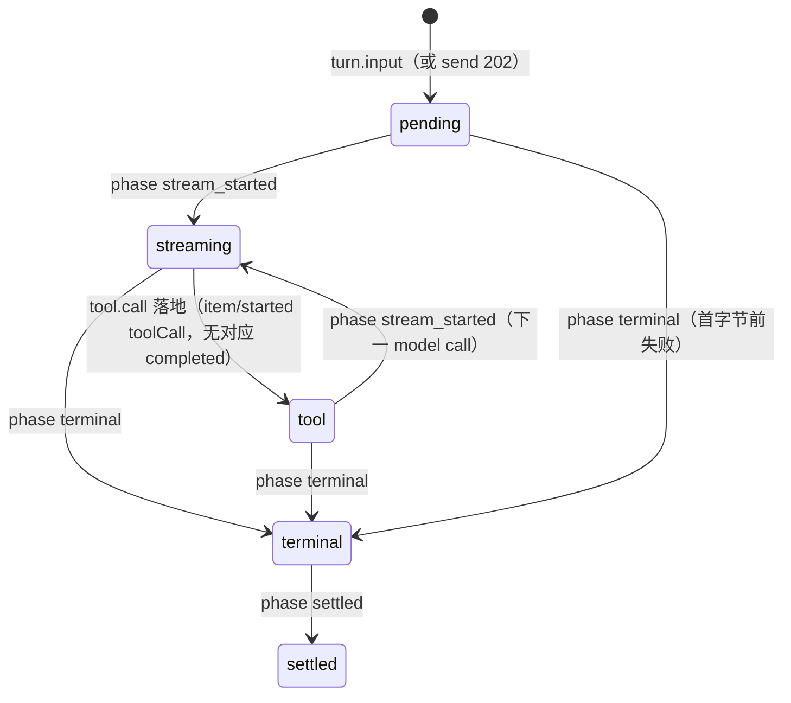

# 流式契约 spec：相位事件 × token delta × 中断语义 × fold 保真清单（#184）

> **provenance**：事实基座 = `docs/research/stream-surface.md`（#183 四面盘点，已并入 main `b1d3bbb`）；本 spec 所有关键锚经 parent 亲验（agent-do.ts / event-log.ts / ux-projection.ts / realtime-ws.ts / hub.ts / threads.ts / config.ts / protocol events.ts / consumeModelCall）。裁定输入 = PM 六裁定（2026-10-04，用户 grilling 前的既定决策）。本仓基线 `b1d3bbb`，bb submodule @ `ba42654`。
> **状态**：待用户过 spec（grilling）——本文是契约，不是实现票；实现切票见 §16。
> **收编**：#148（相位行修 + host_offline 语义）、#149（fold 透明度/debug 面）、T18 投机裁切（provider seam 粒度反哺，§13）、host_offline 语义（§9.3）。

---

## 0. 结论先行（六裁定 → 六决策）

| # | PM 裁定 | 决策 | 一句话理由 |
| --- | --- | --- | --- |
| D1 | 档位分层 | **两层语义**：assistant 文本 = Tier-A 真 token 流（payload 帧载 `model.delta` 跨度）；其余（tool 行、thread meta、interaction）= Tier-B 失效提示 + 节流 refetch（现有 bb 机制） | 「正常 agent 产品」的目的地是渐进文本；全 payload 化让 hub 帧膨胀换零 UX 增益（§2） |
| D2 | 活线接线 | **agent-DO→hub 推式 RPC，delta 帧载 payload**（每 journal 行一 notify，不新增缓冲）；`changed` 指针帧保留给 Tier-B 与重连锚 | journal 行率已被 `deltaFlushMs=100` 压到 ≤10 行/s/call，推 payload 的边际成本可忽略；changed+refetch 是 N+1 × 观看数且新鲜度封顶在节流档（§5） |
| D3 | 相位事件 | **journal 新增 `turn.phase` 族**（stream_started / first_token / terminal / settled / host_lost 五相，显式行）；`chunk_gap` 归 wire 层检测、`tool_phase` 由既有 tool 行承载，不立 journal 行 | 相位真值进 journal 才能杀死 #148 类渲染层模式猜测；journal seq 无洞（event-log.ts:87-127），「chunk 缺口」只可能发生在帧面（§3、§1 词表对齐） |
| D4 | 重连/中断 | **游标 = 客户端已见最大 seq**；重连 = 重订阅 + 有界 catch-up fetch（`events?afterSeq`）；帧是 at-least-once 建议，任何歧义弃帧走 fetch 调和 | journal 是唯一真值，帧是加速器——这把 replay 一致性变成可测不变式而非希望（§8、§10、§14.2） |
| D5 | 背压/节流 | **全部常量具名配置**（服务端 flush 已有 `deltaFlushMs/Bytes`；SPA reveal 层按 omp 30fps/min-3-grapheme/8-frame-catchup 移植；refetch 沿 bb 50/200ms + 50-1000ms 自节流） | omp 与 bb 都已给出实测常数；搬家不改值，只把魔数变配置名（§11） |
| D6 | fold 保真 | **三源清单**：渐进 reveal 允许依赖原始流；终稿文本/tool 状态/turn 结局必须依赖折叠行；计费/导出/重载只允许 journal | 流是可丢的优化，折叠是权威——清单把「哪些判断可以信流」变成契约而非直觉（§12） |

**不改动面（契约冻结）**：journal append 路径与粒度不变（delta 仍逐 flush 行落盘，重放语义零变化）；`/ws` 订阅模型不变（subscribe/unsubscribe × thread-detail/thread-list）；HTTP API 形状不变（`events?afterSeq`、timeline `afterSequence` 照旧）；protocol envelope 身份不变（ux 投影 1:1 保留 seq）。

---

## 1. 词表对齐：#184 票面词表 vs 裁定词表

#184 票面列了七相（stream_started/first_token/chunk_gap/tool_phase/terminal/settled/host_lost），裁定收敛为五行。对齐表：

| 票面词 | 裁定 | 去向 |
| --- | --- | --- |
| stream_started | ✅ journal 行 | §3，语义 = 该次 model call **首字节已见**（`consumeModelCall` 的 `sawFirstByte` 翻转点，agent-do.ts:1337,1381-1385），非 dispatch 时刻——重试可静默失败，首字节才是用户可感的流开始 |
| first_token | ✅ journal 行 | §3，turn 级一次：首个非空 `model.delta` 落盘前 |
| chunk_gap | ⛔ 不立 journal 行 | journal seq 无洞（`transactionSync` 内 MAX+1，event-log.ts:108-125），journal 层不存在缺口；会缺口的是 **WS 帧面** → SPA 缺口检测 + catch-up fetch，归 §8.2/§10 |
| tool_phase | ⛔ 不立 journal 行 | tool 生命周期已有一等行：`tool.call`/`tool.result`（fsm-events.ts:146-186）+ ux `item/started`/`item/completed`（ux-projection.ts:145-199）；Tier-B 失效提示足以驱动 tool 卡片（D1） |
| terminal | ✅ journal 行 | §3，伴随 `turn.completed/failed/cancelled` |
| settled | ✅ journal 行 | §3，静默确认：全部执行终态 + 无在途 re-ask/watchdog 决策。与 terminal 一般相邻，但在 host_offline 不可恢复失败等路径上**真分离**（turn.failed 可先于执行终态，unified-turn-state.md:98） |
| host_lost | ✅ journal 行 | §3，turn 内首个 `tool.dispatch{outcome:"host_offline"}`（fsm-events.ts:155-163）时一次 |

---

## 2. D1 档位分层：两层流语义

| 层 | 覆盖面 | 语义 | 传输 | 粒度 |
| --- | --- | --- | --- | --- |
| **Tier-A：真 token 流** | assistant 正文与 reasoning 文本（journal `model.delta` 跨度） | 渐进显影，帧载文本 | 新 `delta` WS 帧（§6.1）+ 重连调和 | journal 行（≤100ms/2KB 合帧，config.ts:72-73） |
| **Tier-B：失效 + refetch** | tool 行、thread meta（status/title/pin/archive/read）、interaction、system | bb 原语义：`changed` 指针帧 → 节流 refetch（现有 SPA 机制原样） | 既有 `changed` 帧（§6.2 扩展 metadata） | 行级 upsert（timeline `afterSequence`）/ 事件行（`events?afterSeq`） |

**理由（被否替代见 §5.1 R6）**：全 payload 化（tool 输出也走帧）意味着 hub 单 DO 扇出带宽被 tool 输出洪流占用（`tool.output` 可达百 KB 级，r2BypassBytes=100KB 才旁路），而 tool 行的 UX 收益只是「早几十毫秒的 spinner 变化」——bb 实测节流 refetch 已把这类面做到可用（stream-surface.md §2.4）。分层把「必须真流」收窄到用户目的地（渐进文本），把「失效即可」留给其余。

---

## 3. D3 Journal 契约：`turn.phase` 相位族

### 3.1 Schema（packages/agent-do/src/fsm-events.ts `agentEventDataSchemas` 增补）

```ts
"turn.phase": z.object({
  turnId: z.string().min(1),
  phase: z.enum(["stream_started", "first_token", "terminal", "settled", "host_lost"]),
  /** stream_started / first_token 所属的 model call。 */
  modelCallId: z.number().int().positive().optional(),
  /** terminal 相的结局明细；host_lost 恒 "host_offline"。 */
  reason: z.string().min(1).optional(),
}),
```

相位行零 payload、纯标记（≤120 字节/行）；journal 体积影响 O(相数/turn) ≈ 3-6 行/turn，可忽略。

### 3.2 Append 点表（全部由 turn driver 单写者落盘，序由 seq 保证）

| phase | append 时机 | 锚（现行代码位） | 重复语义 |
| --- | --- | --- | --- |
| `stream_started` | `consumeModelCall` 内 `sawFirstByte` 首次翻转，`model.call_started` 之后、首个 delta flush 之前 | agent-do.ts:1337,1381-1385 | **每 model call 一次**（重试/续 call 重复出现是特征不是缺陷；SPA 依 `modelCallId` 开新流卡） |
| `first_token` | turn 的首个非空 delta 即将 flush（`flushDelta` 首次生效） | agent-do.ts:1342-1354 | **每 turn 一次** |
| `terminal` | `turn.completed` / `turn.failed` / `turn.cancelled` append 后同一步 | agent-do.ts turn 终态路径 | 每 turn 一次；`reason` ∈ completed/failed/<failedReason>/cancelled |
| `settled` | driver 收尾：全部执行终态且无在途 re-ask，紧随 terminal（终态先行落盘不变） | unified-turn-state.md §2.1 收尾规则 | 每 turn 一次；host_offline 失败路径可与 terminal 相隔（等 kill/收尸收敛） |
| `host_lost` | turn 内首个 `tool.dispatch{outcome:"host_offline"}` 落盘后 | ux-projection.ts:228-239（现投影为 system/error） | 每 turn 一次；后续 host_offline dispatch 不再重复 |

### 3.3 不变式

- **P1（写序）**：相位行只由 driver 在对应事实行**之后**追加（persist-then-mark，I3 同款）；重放 fold 相位序 = journal 序。
- **P2（单写者）**：相位行只出自 driver/recovery 路径；恢复（`recover()`，agent-do.ts:1027-1093）不为死 turn 补相位——相位是 UX 真值不是 FSM 状态，FSM 状态仍由既有 turn.* 行派生（unified-turn-state.md §2 职责不变）。
- **P3（可重放纯）**：任何SPA 状态 = fold(journal)，相位行参与 fold 但永不反向决定 journal。

---

## 4. 投影契约：UX envelope 新增 `turn/phase`

packages/protocol/src/events.ts `threadEventDataSchemas` 增补（additive，客户端可忽略）：

```ts
"turn/phase": z.object({
  turnId: turnIdField,
  phase: z.enum(["stream_started", "first_token", "terminal", "settled", "host_lost"]),
  modelCallId: z.number().int().positive().optional(),
  reason: z.string().min(1).optional(),
}),
```

`projectToUxEvents`（ux-projection.ts）为 `turn.phase` 增加 1:1 直投 case（seq/createdAt 原样保留，与 §1.4 现行 1:1 规则一致）。`GET events` / `events/wait` 的 ux 视图随之自然携带相位行；timeline 投影（services/timeline.ts）**M-stream-1 不消费相位行**（§7）。

---

## 5. D2 传输选型：活线怎么接

### 5.1 候选与否决（含数字）

| 候选 | 判定 | 数字与理由 |
| --- | --- | --- |
| **R1：agent-DO→hub 推式 RPC，delta 帧 payload**（agent-DO 逐 journal 行 notify，hub 扇出新帧） | ✅ **选定** | journal 行率已被既有 flush 压到 ≤10 行/s/call（deltaFlushMs=100 / deltaFlushBytes=2048，config.ts:72-73）→ notify ≤10 RPC/s/turn，帧 ≤2KB 典型（100KB 上限才 R2 旁路）。生产者侧零新增缓冲、零新增定时器（DO 单 alarm 纪律不被破坏，agent-do.ts:936-937） |
| R2：changed 指针 only + SPA 定向 refetch delta 行（bb 形） | ✗ | 生产者成本与 R1 相同（同样要一条 notify 活线），差异全在消费侧：每观众每 tick 一条 HTTP 链（Hono 路由 + requirePublicThread + agent-DO getEvents RPC + SQL range）；K 观众线性放大（N+1）；新鲜度封顶在 SPA 节流档（50-1000ms，realtime-cache-registry.ts:135-157）——这是 bb 的「chunk-at-throttle」天花板，不是 Tier-A；躲开 130-260ms 投影重建（bb timeline-cache.ts:8-11）只能绕行 raw events 拉取，每 tick 一次 RPC 仍在。**唯一优势（零协议改动）失效**：SPA 消费层本来就要新建（§8），协议是 additive（旧 SPA 忽略未知帧，realtime-ws.ts:98-100） |
| R3：公共 `/ws` 升级直转 agent-DO hibernation socket | ✗ | tap 已存在但生产死线（agent-do.ts:890-901 无路由可达，stream-surface.md §1.4）；把升级指过去 = 多线程订阅面碎片化：thread-list 聚合、跨 thread 多 tab、interaction patch 全活在 hub 单点（hub.ts:11,49-138）；还要 hub↔DO 双连接管理。推式（R1）保持客户端单连接 |
| R4：SSE | ✗ | 全仓负证据：无 SSE/chunked/ETag（stream-surface.md §1.3）；Hono-on-Workers 流式响应与 DO hibernation 语义两套心智；每客户端第二条长连与 `/ws` 职责重叠 |
| R5：仅强化轮询（events/wait 切片更细） | ✗ | 每观众每 tick 一个 agent-DO RPC + 空转轮询；新鲜度/负载权衡劣于推；≤500ms 切片打盹正是被本 spec 降级的补丁（threads.ts:650-653） |
| R6：hub 反向订阅各 agent-DO `/ws` | ✗ | 倒置生命周期：hub 持有 per-thread 出站 socket 的重连/驱逐/背压管理，故障面 ×2，且跨两跳无序——R1 的每调用无状态 RPC 天然免维护 |

### 5.2 选定形状

```
turn driver ──appendEvent──► EventLog(persist) ──► applyEvent ──► pushToSubscribers(死线,保留)
                                                      │
                                                      └─► fire-and-forget hub notify（新增）:
                                                            model.delta(inline) → notifyThreadDelta(payload)
                                                            turn.phase          → notifyThread(["phase-changed"], metadata.phase)
                                                            其余 Tier-B 行       → notifyThread(["events-appended"], {eventTypes, latestSeq})
```

- **方向**：生产者推（R1）；**节奏**：每 journal 行一 notify（flush 已合帧，不再加缓冲层）；**失败语义**：notify 永不使 append 失败（`void stub.notify…catch(console.error)`，与 pushToSubscribers 的 socket 容错同款，agent-do.ts:1130-1137）。
- **绑定**：`AgentDoBindings` 增 `HUB?: DurableObjectNamespace`。组合部署零新增 wrangler 配置——`ComposedAgentDO` 与 `NotificationHubDO` 同 worker 导出、共享 env（index.ts:36-44；env.HUB 已存在，system.ts:252-255）；rig/单测未绑定时 notify 静默 no-op（与 `DAEMON_SERVICE === undefined → host_offline` 同款守卫，agent-do.ts:666-668）。
- **events/wait 唤醒**：notifyThreadDelta 与 phase notify 同样调 `resolveThreadWaiters(threadId)`（hub.ts:93 先例）→ `events/wait` 的 ≤500ms 切片打盹降级为空闲安全网（§7）。

### 5.3 容量账与风险位（诚实数字）

- 单 hub DO 入向：10 RPC/s × T 并发流 turn。T=50 → 500 RPC/s；handler 是纯内存扇出（broadcastChanged + waiter resolve，无存储），DO 输入门串行处理此量级可行 **[INFERENCE，L2 实测项]**。
- 逃逸阀（触发条件 = L2 实测 hub 入向 p95 延迟 > 50ms 或帧滞后 > 500ms）：(a) `deltaFlushMs` 100→200（折半行率）；(b) hub 按 threadId 哈希分片（`idFromName("hub")` → `idFromName("hub:<shard>")`，订阅路由随分片键）；(c) Tier-B hint 在 hub 侧 per-thread 合并（bb NotificationBuffer 移植）。三者均不破坏本契约形状，切票归 §16 S7。

---

## 6. Wire 契约：帧 schema

### 6.1 新帧 `delta`（Tier-A payload，server→client only）

```ts
{
  type: "delta",
  entity: "thread",
  id: threadId,
  turnId: string,
  itemId: string,        // `itm-am-<turnId>:<modelCallId>`（ux-projection.ts:118 同构）
  seq: number,           // 该 model.delta 行的 journal seq（单行跨度）
  text?: string,         // inline 文本；R2 旁路行（≥100KB）缺省 → 帧只作新鲜度信号
  latestSeq: number,     // hub 出帧时该 thread 高水位（兼 refetch 游标提示）
}
```

- 扇出目标：仅 `thread-detail:<id>` 键（thread-list 不渲染文本，不收 delta）。
- 校验：hub 出帧前 strict schema 校验，无效帧跳过不崩（broadcastChanged 同款，hub.ts:242-247）。
- 顺序：DO→DO RPC 不保序 → **消费端按 seq 调和**（§8.2），帧本身无序保证。

### 6.2 `changed` 帧扩展（Tier-B + 相位）

`realtimeThreadChangeMetadataSchema`（realtime-ws.ts:61-81，strict）增两个 optional 字段：

```ts
eventTypes?: string[],                    // bb 同名 metadata 语义：refetch 时客户端可只拉相关 query
phase?: {                                 // changes 含 "phase-changed" 时必携
  turnId: string, phase: "stream_started"|"first_token"|"terminal"|"settled"|"host_lost",
  modelCallId?: number, reason?: string,
},
```

`threadChangeKindSchema`（realtime-ws.ts:18-26）增 `"phase-changed"`。相位低频（≤6 行/turn），不合并、即时出帧。

### 6.3 兼容性

- 旧 SPA（bb 现构建）忽略未知帧型与未知 change-kind、剥离未知 metadata 字段（bb ws.ts:144-154 宽松解析；realtime-ws.ts:98-100 注释即此契约）→ **服务端可先行上线**。
- 新 SPA 消费 §8 消费层；Tier-B 处理路径与 bb 现行为逐字节兼容（50/200ms 去抖 + registry 路由原样）。

---

## 7. HTTP 契约（不变面）

| 端点 | 契约变化 |
| --- | --- |
| `GET /threads/:id/events?afterSeq=&limit=` | **无形状变化**；ux 视图新增 `turn/phase` 行 → 它就是 catch-up/调和的权威读取面（§8.3、§10） |
| `GET /threads/:id/events/wait` | 语义不变（type 等待 + afterSeq）；唤醒源从「≤500ms 切片盲轮询」变为「notify 直醒（delta/phase/changed notify 都 resolveThreadWaiters）」，切片打盹保留为空闲安全网；`threads.ts:650-653` 的补丁注释随之失效删除 |
| `GET /threads/:id/timeline` | **M-stream-1 不变**（in-turn 对话行生长不靠 timeline 投影，靠 §8 delta 面timeline 折 delta 进对话行列为 S6 可选后续，契约外） |
| send/stop 等控制面 notify | 不变（请求时刻的 events-appended/status-changed 照旧，threads.ts:327-334）；turn 中途通知由 §5.2 活线接管 |

---

## 8. SPA 消费层契约（Tier-A 面；Tier-B 沿用 bb 现机制）

### 8.1 游标状态（每 thread-detail 订阅一份）

- `cursorSeq`：已应用的最大 journal seq（初始 = timeline bootstrap 的 latestSeq，或 0）。
- `pendingReconcile: boolean`：检测到帧缺口/blob 洞时的调和标记。
- `serverHighWater: number`：帧/changed 携带的最新 `latestSeq` 高水位，只驱动 catch-up 排程，不参与游标推进（§8.2）。

### 8.2 帧应用规则（确定性，全部可测）

| 入帧 | 规则 |
| --- | --- |
| `delta{text,seq}` | `seq ≤ cursorSeq` → 丢弃（at-least-once 去重）；`seq > cursorSeq` 且该 item 无缺口 → 追加文本到该 item 流缓冲，`cursorSeq = seq`（游标只按**已应用行**推进）；`text` 缺省（R2 洞）→ `pendingReconcile = true`；帧的 `latestSeq` 记为独立 `serverHighWater`，只用于排程 catch-up，**永不推进游标**（未应用行不得计入已见） |
| `delta` 到达但本 item 此前 seq 缺口（如断连漏帧后首个帧） | 弃文本载荷，转 catch-up fetch（§8.3）——**宁可弃帧不可猜** |
| `changed{events-appended, latestSeq}` | `latestSeq > cursorSeq` → 节流排程 catch-up fetch（bb 常数，§11）；Tier-B refetch 路由照旧 registry |
| `changed{phase-changed}` | 更新该 turn 相位状态机（§9），terminal/settled 触发权威调和（§9.2） |
| 任何歧义（乱序/跨游标/解析失败） | 弃帧 + 排程 fetch。**不变式：渲染文本 ≡ fold(journal[seq ≤ cursorSeq])，帧只允许加速到达，不允许偏离** |

### 8.3 Catch-up 与调和

- fetch = `GET events?afterSeq=cursorSeq&limit=100`（ux 视图，含 delta 行 + 相位行），应用后 `cursorSeq = 返回行最大 seq`；>1 页则连页直到追平。
- 调和时机：`pendingReconcile` 置位时（节流内）；`item/completed{agentMessage}` 到达时（终稿换缓冲，omp print-mode 原则：end 权威，print-mode.ts:68-92）；terminal/settled 相位到达时（§9.2）。
- 该规则同时就是重连补课路径（§10）——**同一套代码，无重连特例**。

---

## 9. 相位状态机与渲染真值

### 9.1 SPA 每-turn FSM（数据源 = journal 行 + 相位帧，fold 纯函数）



- `host_lost` 是**叠加态**不是迁移：任何非 settled 态可携带，直至 settled 清除。
- 传输断连是**连接态**不是相位：socket drop → §10 补课，不污染 turn FSM。
- `streaming` 内部无子相——`first_token` 不改状态，只解除「尚无文本」的渲染分支（omp：`message_start` 建空卡，event-controller.ts:1204-1209）。

### 9.2 迁移表（journal 证据 → 动作）

| 迁移 | journal 证据 | SPA 动作 |
| --- | --- | --- |
| → pending | `item/started{userMessage}` | 拉 working 指示（提交即拉，无占位气泡；omp interactive-mode.ts:3179,3275） |
| → streaming | `turn.phase{stream_started}` | 武装空流缓冲（per itemId） |
| first_token | `turn.phase{first_token}` | 显影层启动（§11 reveal 常数） |
| → tool | `item/started{toolCall}` | tool 卡片入场（Tier-B refetch 供 args/output） |
| → terminal | `turn.phase{terminal}` | 停显影；取消 in-flight fetch；**立即**权威 refetch 并以折叠行换流缓冲（realtime-cache-registry.ts:249-263 终态先例） |
| → settled | `turn.phase{settled}` | 丢弃乐观/流缓冲，终视图 = 折叠行；清除 host_lost 叠加 |
| +host_lost | `turn.phase{host_lost}` | §9.3 真值矩阵；不迁移 |
| 流中断重试 | `model.call_failed{retryable}` → 新 `stream_started{modelCallId n+1}` | 新 itemId = 新流卡；旧尝试的 delta 行留折叠视图（partial 卡 + system/error，ux-projection.ts:214-226）；**不从头顶重放已完成卡**（omp auto_retry 语义，stream-surface.md §4） |
| 用户停止 | `turn.cancel_requested` → `terminal{cancelled}` | 冻结显影 → 终态调和；已显影文本由折叠行接管 |

### 9.3 渲染真值矩阵（#148 修复面； SPA 判断只读此矩阵，禁止从「横幅-worthy 行存在」猜状态）

| turn FSM 态（含叠加） | host-offline 横幅 | working 指示 | 文本显影 | tool 卡 |
| --- | --- | --- | --- | --- |
| pending / streaming / tool（无 host_lost） | ✗ | ✓ | —/✓/— | 正常 |
| pending / streaming / tool **+ host_lost** | **✗（#148 主断言）** | ✓ | 有 delta 则✓ | 「宿主离线」占位结果（bb 占位语义） |
| terminal（sealed/failed 含 host_offline reason） | ✗ | ✗ | ✗（终稿已换） | 终态卡 + system/error 就地渲染 |
| settled + 无活跃 turn + runtime host 离线 | ✓（诚实宿主态，bb `host-reconnecting` runtime status 对应面） | ✗ | — | — |

横幅唯一合法来源 = 「无活跃 turn ∧ runtime host 离线」；活跃 turn 期间横幅恒 ✗。

---

## 10. 中断/重连 UX 语义（D4）

- **游标即 resume token**：客户端持久面无服务端要求（unified-turn-state.md §1.6 原文：游标 = 已见最大 seq；重连携带 since_seq；按 seq 去重，推送 at-least-once）。hub/agent-DO **不保存任何 per-connection 状态**（hub attachment 仅订阅键，hub.ts:273-280）。
- **重连梯**（SPA 侧，bb 单例 ReconnectingWebSocket 语义不变，ws.ts:62-81）：open → 重发全部 subscribe → 立即全速 catch-up fetch（§8.3，无节流——重连首拉不受 50ms 地板约束）→ 期间流缓冲挂「catching-up」态而非清空。
- **Tier-B 补课**：重连后全量失效 realtime query keys（bb `invalidateRealtimeQueriesAfterServerReconnect` 移植，system-cache-effects.ts:47-100）。
- **长中断**（>60s 或 fetch 失败链）：放弃增量，回 timeline bootstrap 重建 + 游标重置 latestSeq（与冷加载同路径）。
- **hub 重部署/DO 驱逐**：socket 全断 → 同重连梯；journal 无损，语义不变。
- **多标签**：各自游标互不干扰；delta 帧按订阅扇出到全部 detail socket，调和规则幂等。

---

## 11. 背压与节流常数（D5；全部具名配置，禁止魔数）

| 常数 | 默认 | 宿主 | 锚 |
| --- | --- | --- | --- |
| `deltaFlushMs` | 100 | agent-DO WatchdogConfig（**已有**） | config.ts:73；unified-turn-state.md:114 |
| `deltaFlushBytes` | 2048 | 同上（**已有**） | config.ts:72 |
| `r2BypassBytes` | 102400 | 同上（**已有**，兼 delta 帧inline 上限） | config.ts:74；event-log.ts:42-47 |
| `reveal.fps` | 30 | SPA 显影层配置 | omp STREAMING_REVEAL_FRAME_MS=1000/30，streaming-reveal.ts:7-9 |
| `reveal.minGraphemesPerFrame` | 3 | 同上 | streaming-reveal.ts:19-28 |
| `reveal.catchUpFrames` | 8（落后自适应追赶窗） | 同上 | streaming-reveal.ts:72-121 |
| `refetch.debounceMs` / `maxWaitMs` | 50 / 200 | SPA Tier-B（bb 移植，**已有语义**） | realtime-cache-effects.ts:29-30,228-232 |
| `refetch.selfThrottleFloorMs` / `CapMs` | 50 / 1000 | 同上（event storm 自节流，≈50% 占空比） | realtime-cache-registry.ts:135-157 |
| `catchup.fetchLimit` | 100 | SPA（服务端路由默认同行） | threads.ts:593-613 |
| `reconnect.firstFetchThrottled` | false | SPA（重连首拉不受节流） | §10 |

**服务端不新增定时器**：notify 节奏 = journal flush 节奏（§5.2）；SPA 显影层是唯一 paced 组件（30fps 本地渲染，与 wire 解耦——wire 10Hz 供给、渲染 30fps 消费，中间是流缓冲）。

---

## 12. D6 Fold 保真清单（哪些 UX 判断可依赖原始流）

| UX 判断 | 允许的数据源 | 禁止的数据源 | 理由 |
| --- | --- | --- | --- |
| 渐进文本显影/速度感 | delta 帧 + delta 行（流缓冲） | — | 显影本质是暂态视效，帧丢弃由调和兜底 |
| first-token 延迟展示、tok/s 估算 | 相位行 + 帧到达时刻（display-only） | — | 展示性近似，不作账 |
| **消息终稿文本** | `item/completed{agentMessage}` 折叠行 | 仅帧累积缓冲 | 帧可丢/乱序；终稿必须 journal 权威 |
| **tool 卡状态/输出** | `item/completed{toolCall}` + Tier-B refetch | 帧推断 | Tier-B 语义（D1） |
| **turn 结局**（completed/failed/interrupted） | `turn/completed` envelope | 相位帧单独 | 相位行是提示，turn.* 行是事实 |
| 相位 chip（streaming/tool/settled 显示） | `turn/phase` 行（journal 或帧均可） | 渲染层猜测 | 这正是 #148 的教训反写 |
| host 离线占位/横幅 | §9.3 矩阵（journal 相位 + dispatch 行） | 横幅-worthy 行存在性启发 | 同上 |
| **计费/token 用量** | 仅 journal | 一切帧 | 帧按设计可丢（D4），计费不可丢 |
| **重载/导出/历史视图** | 仅 journal（timeline + events） | 一切帧 | 会话真值重放面 |
| interaction 问题正文 | journal refetch（现行规则不变） | socket payload | realtime-ws.ts:65-71 既有裁定原样保留 |

一句话：**流允许驱动「正在发生」的观感；折叠独占「已经发生」的事实。**

---

## 13. Provider seam 粒度反哺：T18 投机裁切边界

- 现 seam 合同：`streamTurn` 产出 `text-delta` 零或多个 + **至多一个终端 `tool-calls` 块（仅完整调用）**——「stream fragments are deltas, never tool.call events」（provider.ts:129-163，§2.2 ruling B）。journal 侧对应：`model.delta` 只载文本；`tool.call` 在解析完成后落行（ux-projection.ts:145-167）。
- 推论：**T18 投机预启动（流中逐项解析 toolcall args 提前 spawn）在本契约下无数据源**——seam 不产 arg delta，journal 不载 arg span，wire 不载 toolcall payload。本 spec **不扩展** seam（动它 = 动 §2.2 既有裁定 + I21 幂等面，超出 m-stream-1）。
- 反哺结论：T18 的裁切预案（「投机预启动若超窗则裁为尾随子票、默认关闭」，m15-ticket-set.md:355）在本契约下**维持成立且成本更低**——未来若开投机面，增量 = seam 新 chunk kind `tool-input-delta` + journal 族 + delta 帧扩型，三处都是 additive 扩展点（本 spec 的帧 seq 调和规则原样适用），无需返工既有面。

---

## 14. 测试策略

### 14.1 L1（vitest in-workerd；WS 套件 `--max-workers=1 --no-isolate`，testing-strategy-cloudflare-do.md §6）

| 组 | 断言 |
| --- | --- |
| 相位行 append 点 | 驱动单测：stream_started 每 call 一次且在首 delta 前；first_token 每 turn 一次；terminal/settled 序；host_lost 每 turn 一次且由 host_offline dispatch 触发（§3.2 表逐行） |
| append→notify 面 | persist-then-notify（I3 同构）：mock hub 记录 notify 序 = journal seq 序；notify 抛错不失败 append；未绑 HUB 时 no-op |
| delta 帧 schema | strict round-trip；R2 旁路行 → text 缺省帧；latestSeq 高水位正确 |
| hub 扇出 | K detail socket 收 delta、list socket 不收；无效帧跳过不崩；notifyThreadDelta/phase 均resolveThreadWaiters（events/wait 醒） |
| 兼容 | 旧客户端帧解析：未知帧型/未知 kind/metadata 剥离不炸（bb 宽松解析合同） |
| 投影 | `turn.phase → turn/phase` 1:1（seq/createdAt 保留）；parseThreadEvent round-trip |

### 14.2 Replay 一致性（property test，本契约的核心不变式）

- **收敛 oracle**：随机生成 journal 后缀（delta/相位/Tier-B 行混合，含 R2 洞行）× 随机帧丢弃/乱序/重复 × 随机断连点 → SPA 侧应用（帧 + 节流 catch-up fetch mock）→ 断言任意时刻 `渲染文本 ≡ fold(journal[≤cursorSeq])` 且收敛后终态 = 全量 fold。
- **序不变式**：任何投影视图重放（projectToUxEvents 全量重跑）与增量应用终态逐 seq 相等。
- **终态权威**：terminal 后缓冲置换 = 折叠行（字节级）。

### 14.3 L2（staging 协议面冒烟脚本）

- 真实 WS 客户端：subscribe → send → 量 first_token 帧延迟、delta 帧间隔分布、terminal→settled 序、`events/wait` 醒延迟（应 ≤ notify RTT，不再是 500ms 切片）。
- **容量实测位（§5.3 预注册）**：T 并发 turn 下 hub 入向 p95 与帧滞后；阈值触发 S7 逃逸阀。
- 预注册阈值（L2 首测冻结）：first_token P50 ≤ 600ms（send→帧）；活跃流 delta 帧间隔 p95 ≤ 400ms；重连 catch-up ≤ 2 个 fetch 页。

### 14.4 L3（staging 故障注入 + 双设备，手册）

- 流中杀 daemon（host_offline + sealed）→ §9.3 矩阵逐格人验（无横幅抢占、占位结果、终态诚实）。
- 流中重部署触发 DO 驱逐 → 重连补课收敛；多标签一致性；流中刷新 SPA（bootstrap 中途 turn）。

### 14.5 jev-loop 验收钩子（PM 侧验收面；jev text-only/不能数数约束，jev-browser-loop.md §1/§2）

DOM 合同（SPA 渲染层从**同一份 FSM 状态**写出，非 test-only 通路）：

| 钩子 | 形状 | 消费方断言（代码做，jev 只做语义判读） |
| --- | --- | --- |
| turn 容器 | `[data-turn-id="<id>"][data-turn-phase="pending|streaming|tool|terminal|settled"]` | 相位迁移存在性/顺序（§9.1） |
| 助手文本 | `[data-role="assistant-text"]` | 两次 CDP 采样文本增长（jev T2 = #148 正面场景） |
| host 横幅 | `[data-banner="host-offline"]` | 活跃相位（pending/streaming/tool）期间**不存在**（jev T3 = #148 验收原文） |
| tool 占位 | `[data-tool-status="host-offline"]` | host_lost 后出现 |
| 流卡 | `[data-item-id="itm-am-<turnId>:<callId>"][data-streaming="true|false"]` | 每 modelCall 一卡（§9.2 重试行） |

场景映射 jev spike T1-T3（jev-browser-loop.md §6.1）原样可用；新增 T4：流中刷新 → 文本恢复且相位 chip 正确（D4 验收的浏览器面）。断言阈值跑前冻结（预注册纪律）。

---

## 15. 风险与逃逸阀

| 风险 | 触发信号 | 阀 |
| --- | --- | --- |
| hub 单 DO 入向饱和 | L2 入向 p95 > 50ms / 帧滞后 > 500ms | §5.3 (a)(b)(c)：flush 加倍 / hub 分片 / hint 合并——均不改帧契约 |
| delta 帧乱序窗口造成显影抖动 | L3 观感 | 消费端 seq 调和已定义（§8.2）；必要时显影层对乱序做 1 帧悬挂（配置项，非契约） |
| 相位行被未来路径滥写成 FSM | review | P2 单写者（§3.3）：相位只出自 driver/recovery 收尾，FSM 状态仍归 turn.* fold |
| R2 洞高频（超大单 chunk） | L1 计数 | 洞行 → hint 帧 + 调和；`deltaFlushBytes=2KB` 使洞天然罕见 |
| bb SPA fork 面改动超窗 | 切票时 | S4/S5 允许落在 Samuka007/bb fork（bb-internal，AGENTS.md §Submodule）或后继 SPA——契约不变 |

---

## 16. 切票建议（PM 下一跳；每票按 DoR 六字段带齐后派发）

| 票 | 范围 | 前置 | 锚 | 验收 | 预算（参照类） |
| --- | --- | --- | --- | --- | --- |
| **S1 协议词表**（P0） | fsm-events `turn.phase` + protocol `turn/phase` + `delta` 帧 schema + changed metadata 扩展（eventTypes/phase）+ builders；纯类型/schema + round-trip 测试 | 无（本 spec 过 grilling 即可） | §3.1/§4/§6 | schema round-trip 全绿；旧客户端宽松解析测试 | ≤2h（FixUxBatch 单项 ≈1h 参照） |
| **S2 agent-DO 相位行 + notify**（P0） | §3.2 五个 append 点（consumeModelCall/driver）+ `HUB?` 绑定 + fire-and-forget notify（delta/phase/Tier-B 三分支） | S1 | §3.2/§5.2 | L1：append 点矩阵 + persist-then-notify + rig no-op | ≤半窗（单文件 driver 改造 + 单测） |
| **S3 hub delta 扇出**（P0） | `notifyThreadDelta` RPC + delta 帧扇出（detail-only）+ waiter 唤醒 + strict 校验跳过 | S1 | §5.2/§6.1/§7 | L1 WS 套件：扇出/唤醒/坏帧；threads.ts:650-653 注释删除 | ≤半窗 |
| **S4 SPA 消费层**（P1） | 游标 + §8.2 帧应用 + catch-up + Tier-B 常数落位；delta 帧处理接进现 WS 层 | S3 | §8/§10/§11 | L1 property（§14.2 收敛 oracle）+ 旧客户端兼容 | 1 窗（bb registry 整面移植，复用三问：上游 = bb realtime-cache-*，同构可搬） |
| **S5 SPA 显影层**（P1） | omp StreamingRevealController 移植（30fps/3-grapheme/8-frame）+ §11 配置化 + DOM 合同钩子（§14.5） | S4 | §11/§14.5 | 渲染节流单测 + 钩子 DOM 合同 | ≤半窗（上游 = omp MIT 单文件，直搬） |
| **S6 相位 UX 修复**（P1，收 #148/#149） | §9.3 真值矩阵接线（横幅/占位/终态）+ debug 面读 raw 行（#149）+ jev T2/T3/T4 断言脚本 | S4,S5 | §9.3/§14.5 | #148 验收原文全绿（jev 5-trial）；#149 debug 面可见 raw 事件 | 1 窗 |
| **S7 容量逃逸**（P2，条件票） | §5.3 阀 (a)(b)(c) 之一 | S3 + L2 数字越阈 | §5.3/§15 | L2 复测达标 | 半窗/项 |

依赖图：S1 → (S2, S3) → S4 → (S5, S6)；S7 独立条件触发。S4/S5/S6 的落点仓（bb fork vs 后继 SPA）由 PM 在切票时定，契约面无差。

---

## 附：锚点索引

| 主题 | 锚 |
| --- | --- |
| 死 tap / 活线缺口 | agent-do.ts:1099-1138（append→pushToSubscribers）、:890-901（无路由 /ws）、threads.ts:650-653（500ms 切片自证） |
| journal 词表/序 | fsm-events.ts:71-449；event-log.ts:87-127（seq 无洞）、:42-47（R2 旁路） |
| flush 合帧 | agent-do.ts:1337-1396（sawFirstByte/deltaFlush）；config.ts:72-74 |
| ux 投影 | ux-projection.ts:17-288（1:1、delta/sealed/host_offline/turn.* 各 case） |
| wire 现状 | realtime-ws.ts:18-26（kinds）、:61-81（metadata）、:96-114（server union）、:117-150（builders） |
| hub | hub.ts:79-94（notifyThread+waiter）、:161+（waitThreadEvent）、:242-247（坏帧跳过）、:273-280（attachment 仅订阅键） |
| 组合部署 | index.ts:36-44（同 worker 导出 ComposedAgentDO/NotificationHubDO）；system.ts:252-255（env.HUB） |
| HTTP 面 | threads.ts:593-613（events?afterSeq）、:615-655（events/wait）、:327-334（send notify） |
| turn FSM | unified-turn-state.md §2（状态集/迁移/收尾）、§1.6（客户端游标合同） |
| omp 参照 | streaming-reveal.ts:7-9,19-28,72-121；print-mode.ts:68-92；event-controller.ts:1188-1200,1204-1209 |
| bb 参照 | realtime-cache-effects.ts:29-30,228-232；realtime-cache-registry.ts:135-157,249-263；ws.ts:62-81,144-154；system-cache-effects.ts:47-100 |
| 测试分层 | testing-strategy-cloudflare-do.md §6（L1/L2/L3） |
| jev 验收 | jev-browser-loop.md §1（text-only/不数数）、§6.1（T1-T3） |
| T18 裁切 | m15-ticket-set.md:264-273,355；provider.ts:129-163（seam 粒度） |

> AGENT GENERATED: by zhipu-coding-plan/glm-5.3-flash:max
