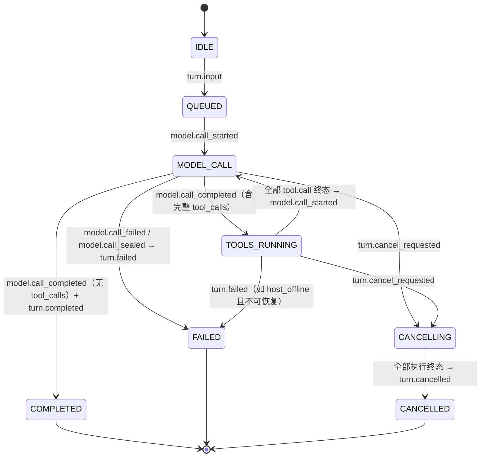
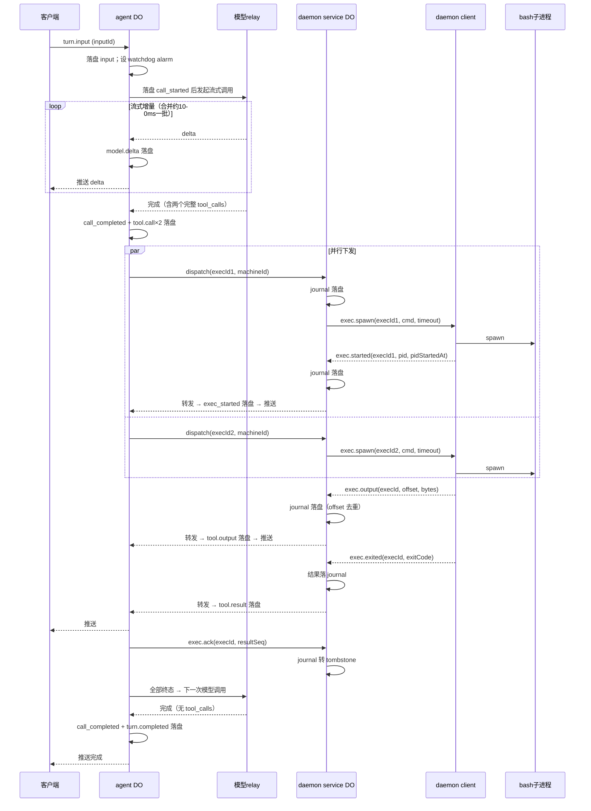
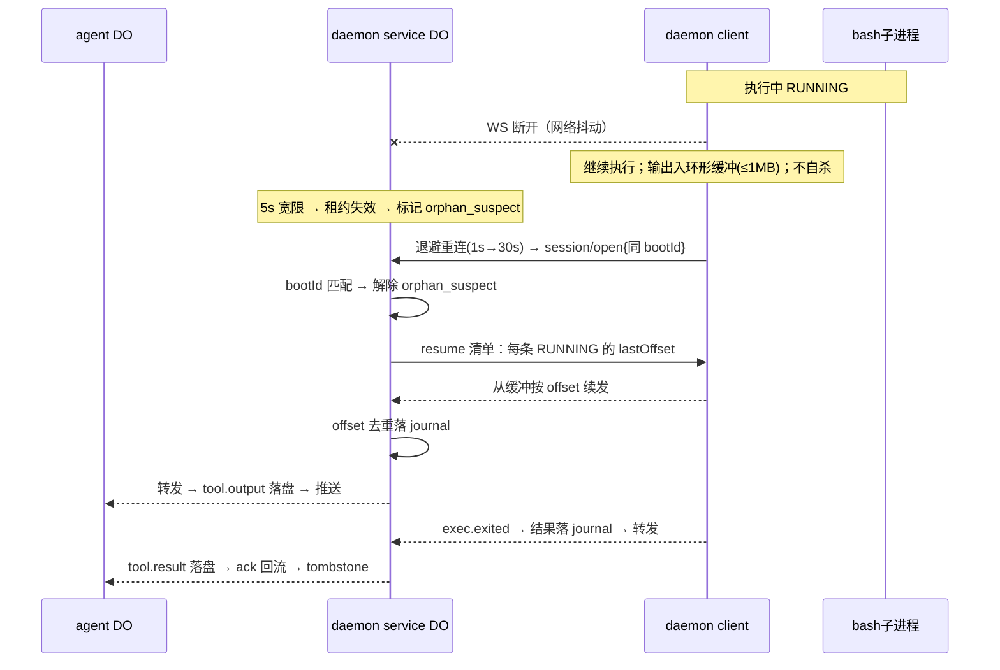
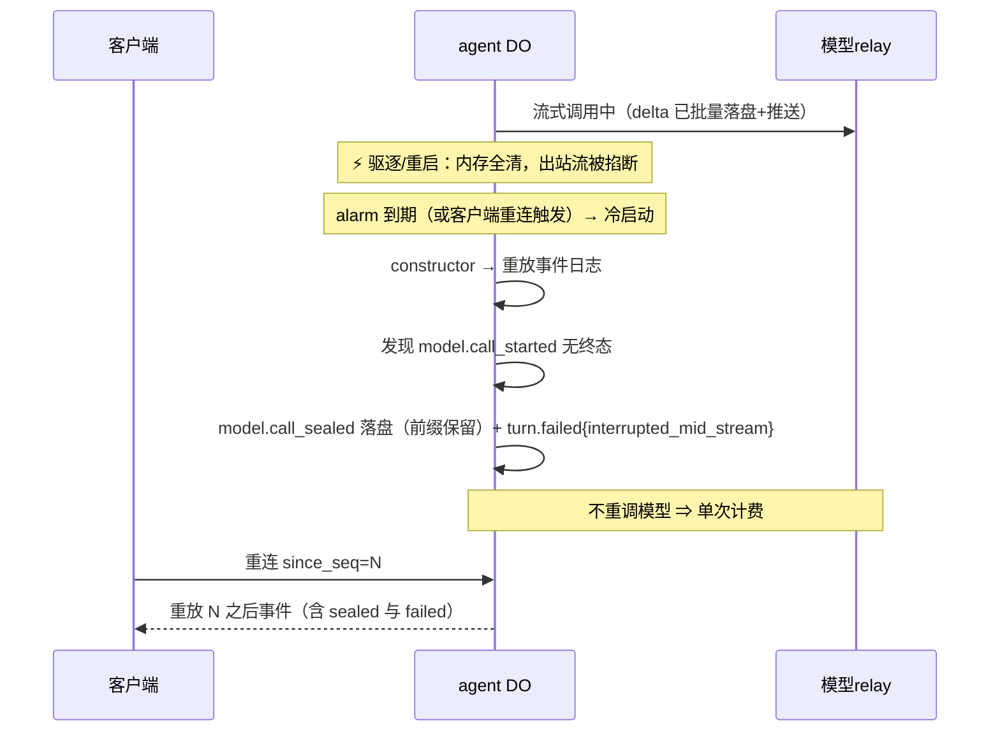
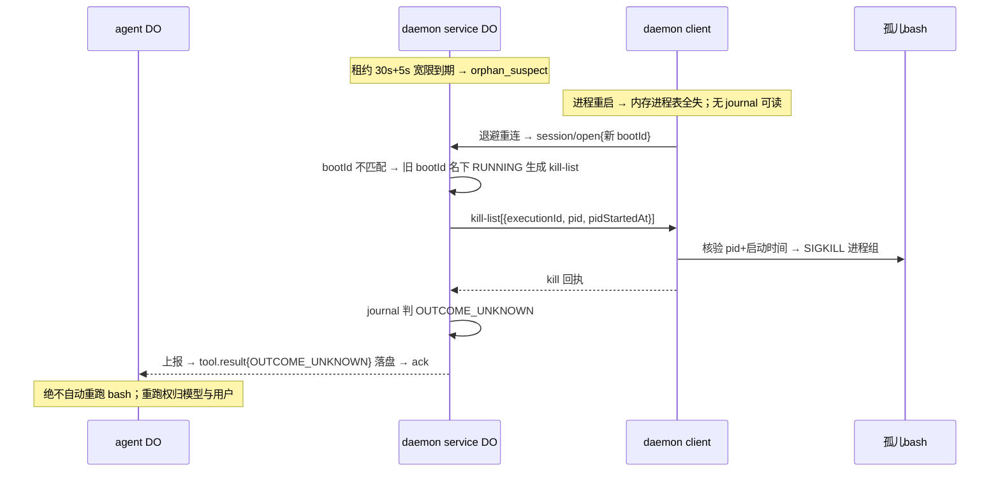

# 统一 turn/执行状态机设计（#23）

> 工单：Samuka007/cloudflare-agent-project#23；spec：#17。
> 输入：`docs/research/do-turn-lifecycle-safety.md`（下称「平台研究」，一切边缘侧恢复裁定以它为依据）、`docs/research/bb-daemon-protocol.md`（下称「bb 研究」，凡 bb 已有成熟答案处直接照搬形状）。
> 拓扑按用户 2026-10-03 新图命名：**bb spa → bb server(worker) → agent DO → daemon service worker → daemon service DO → daemon client on host**；两层 worker 均为无状态路由，不持有任何需要恢复的状态，本文不再单列。旧名对照：ThreadDO = agent DO，GatewayDO = daemon service DO，daemon = daemon client。
> 本文逐格裁定断点矩阵 A–F（C/D/E/F 为两种执行状态所有权模型的对照裁定），补四个新增断点 G/H/I/J，并给出可直接断言的不变量清单喂 #20 的 L1 测试。

## 0. 总原则（先于一切分节）

四条铁律，全部落在应用层（平台研究 §6 的「平台给的和必须应用层补的」）：

1. **先落盘，后副作用**：任何内容在产生外部可见动作（推客户端、下发执行、调用 relay、回 ack）之前，必须已写入对应 DO 的持久层。平台确认屏障保证「落盘前外部看不见」，应用层唯一的责任是不颠倒这个顺序。
2. **重放即真相**：DO 内存态一律是其持久日志的重放产物；冷启动重放重建一切。允许存在辅助索引（幂等集合），但它必须可从日志派生、可随进程丢弃重建——不构成快照表，不违反 spec #17。
3. **恢复动词只有一个：带 executionId 的重派 / 重问**。所有断点的恢复路径统一收敛为「用同一 executionId 重新派发、重新询问、重新附着」，由幂等键在去重点兜底。不发明第二种恢复协议，不发明分布式事务（平台也没有）。
4. **不确定就显式失败，绝不装死，也绝不偷偷重跑**：执行结果不可知时记 `outcome_unknown` 显式终态；重跑非幂等 bash 的决定权只给模型与用户，恢复机制本身永不自动重跑一个外部副作用。

命名约定（全文一致）：

| 名字          | 形状                                                              | 作用域                                      | 用途                                                                  |
| ------------- | ----------------------------------------------------------------- | ------------------------------------------- | --------------------------------------------------------------------- |
| `executionId` | `${threadId}:${callSeq}`（callSeq = 对应 `tool.call` 事件的 seq） | 全局，跨会话、跨重启                        | 端到端幂等键；自路由（threadId 前缀即归属）                           |
| `modelCallId` | 其 `model.call_started` 事件的 seq                                | turn 内唯一                                 | 计费对账；每次调用尝试一个                                            |
| `requestId`   | uuid                                                              | 单次下发尝试、单个 daemon service DO 会话内 | 传输层相关（host-rpc.request/response 配对，bb 形状），**不作幂等键** |
| `inputId`     | 客户端生成的 uuid                                                 | thread 内                                   | 输入去重（WS 消息无重投保证，客户端重发必须安全）                     |
| `bootId`      | uuid，daemon client 每进程启动时在内存生成，不落盘                | 机器一次 incarnation                        | service DO 区分 client「断连」与「重启」的唯一凭据（§5）              |
| `offset`      | 单次执行内输出字节偏移                                            | executionId 内                              | 输出流断点续传与去重                                                  |

## 0.1 所有权裁定摘要

执行状态（「正在跑什么工具调用、输出到哪了、结果是什么」）的 source of truth 有两个候选位置：

- **模型一（host 所有）**：执行状态归 daemon client 的本地 journal（宿主盘 SQLite），边缘只路由。孤儿收尸在 host，重连 resume 靠 client 自己的进程表与 journal。
- **模型二（边缘所有，用户新图）**：执行状态归 daemon service DO（DO SQLite 执行 journal），daemon client **非权威、可替换**——本地状态是物理现实的观察窗与性能缓存（可弃不必无，清单见 §8.1），逻辑真相全在 service DO。孤儿收尸 = service DO 发现租约失效后向 client 发 kill/forget；client 重连即重置；result 送达以 service DO 为准。

**本文主线裁定：断点 C/D/E/F 全部推荐模型二**（逐格理由见 §3）。核心理由一句话：模型一把 claim 权威放在全系统最不耐久、最不可信的节点（dev LXC 上一张可被用户随手 wipe 的 host journal），模型二把它放进有平台确认屏障与重放语义的 DO SQLite，client→edge 这一段只剩「字节流按 offset 重发+去重」这一种故障形态，而这正是 DO 平台的强项。代价是输出在边缘持久化两次（service DO journal + agent DO 事件日志）与新增 kill-list/offset 协议面——有聊但无聊，见 §3 逐格对照。

## 1. 节点状态清单

### 1.1 agent DO（每 thread 一只）——turn FSM 与事件日志的唯一权威

- **持久（DO SQLite）**：append-only 事件日志，`(threadId, seq)` 唯一索引；alarm 状态。M0 事件类型全集：
  - thread：`thread.created`
  - turn 生命周期：`turn.input`、`turn.steer`、`turn.cancel_requested`、`turn.completed`、`turn.failed`、`turn.cancelled`
  - 模型调用：`model.call_started`、`model.delta`（合并批量）、`model.call_completed`、`model.call_sealed`、`model.call_failed`、`model.call_retry`
  - 工具执行：`tool.call`、`tool.dispatch`、`tool.exec_started`、`tool.output`（合并批量，带 offset）、`tool.result`
  - 大负载（>~100KB）只存 R2 引用 `{key, size, sha256}`。
- **随进程死**：重放出的 FSM、进行中的 relay 出站流、幂等索引（内存集合，重放重建）、客户端 WS（hibernation API 接入；attachment ≤16KB 只放 cursor 缓存等易失优化，丢了无害）。
- **权属**：turn/工具调用状态迁移的唯一发起点；结果是否被 trajectory 承认（ack 权威）；一切对外副作用只能在落盘之后发出。

### 1.2 daemon service DO（每机器一只）——会话/租约权威 + 执行状态的 claim 权威（模型二）

- **持久（DO SQLite）**：
  - 当前会话记录 `{sessionId, hostId, bootId, leaseExpiresAt, protocolVersion}`；
  - **执行 journal**：`executionId → {command, cwd, timeout, pid, pidStartedAt, clientBootId, state, lastOffset, result, acked}`。result 内联上限 1MB，超限截断并置 `truncated`（agent DO 侧 >~100KB 再走 R2 旁路）。journal 写入先于任何转发/上报（本地同样遵守先落盘后副作用）。
- **不持久**：in-flight `requestId → executionId` 映射——requestId 不跨会话，会话重建后一律作废（断点 C），不值得持久化。
- **随进程死**：client WS（hibernation API 接入，休眠时连接由边缘保持、内存清空）、requestId 映射、租约计时。
- **权属**：「执行是否发生、跑到哪了、结果是什么」的唯一权威（claim 侧）；结果保留到 agent DO ack 为止，ack 后转 tombstone（§5）。

### 1.3 daemon client（每台机器一个，非权威、可替换执行器）

- **持久（宿主盘，仅身份）**：`{hostId, hostKey}`。**没有执行逻辑 journal，没有 bootId 落盘**——bootId 每进程启动内存生成。client 的本地状态是物理现实的观察窗与性能缓存（可弃不必无），完整清单与各自崩溃下场见 §8.1。
- **随进程死**：进程表（executionId→pid/管道，纯内存——OS 物理现实的观察窗）、WS 连接与退避状态、输出环形缓冲（每执行 ≤1MB，溢出置 `output_truncated`，执行继续）。
- **行为契约**：收 `exec.spawn` 就 spawn（注入 marker 环境变量 + 独立进程组，§8.1）并回报 `{pid, pidStartedAt}`；收字节流就按 offset 上行；收 `exec.kill` 就核验 pid+启动时间后杀进程组；收 kill-list 就逐条核验执行；重连即重置（新 session/open + 全量 boot.announce，bootId 说明一切，§8.2）。断连期间不自主做任何生命周期决定（不自杀在跑进程，理由见断点 D 模型二裁定）。

### 1.4 子进程（bash/PTY）

- **持久**：它对宿主文件系统做的一切——真实、不可回滚的副作用。
- **随进程死**：其余全部。client 死 → 变孤儿；client 重启后由 service DO 下发的 kill-list 收尸（§5）。

### 1.5 模型 relay

无状态、按调用计费、非幂等。每次调用尝试对应一个 `model.call_started` 事件（modelCallId），账单可对账到事件粒度。恢复语义全部在 agent DO。

### 1.6 客户端（SPA/curl）

- **持久**：无服务端要求；游标 = 已见最大 seq。
- 重连携带 `since_seq`，agent DO 从日志重放 `seq > since_seq` 的事件；客户端按 seq 去重（推送是 at-least-once）。

### 1.7 R2

大负载旁路，事件日志只存引用。M0 不做孤儿 blob GC（M1 再议），只保证引用完整。

## 2. turn 生命周期状态机（含并行工具调用、steer、取消）

### 2.1 状态集与迁移

Turn 聚合状态全部从事件重放派生，归属 agent DO：



迁移表（副作用永远发生在事件落盘之后）：

| 事件                                       | 前置状态                         | 后置状态                   | 落盘后的副作用                                                                                                          |
| ------------------------------------------ | -------------------------------- | -------------------------- | ----------------------------------------------------------------------------------------------------------------------- |
| `turn.input`                               | IDLE（无活跃 turn）              | QUEUED                     | 设 turn watchdog alarm；发起首次模型调用                                                                                |
| `turn.input`（活跃 turn 中）               | 任意非终态                       | 不变                       | 改写为 `turn.steer` 落盘（M0 单活跃 turn；`inputId` 照常去重）                                                          |
| `model.call_started`                       | QUEUED / TOOLS_RUNNING（全终态） | MODEL_CALL                 | 调 relay（一次计费尝试，记 modelCallId）                                                                                |
| `model.delta`（合并批量，~100ms/2KB 粒度） | MODEL_CALL                       | 不变                       | 推客户端                                                                                                                |
| `model.call_completed`                     | MODEL_CALL                       | TOOLS_RUNNING 或 COMPLETED | 逐个 `tool.call` 落盘并下发 / 落 `turn.completed`                                                                       |
| `model.call_failed`                        | MODEL_CALL                       | FAILED 或重试              | 可重试错误且重试次数 <2 → 退避后新 `model.call_started`；否则 `turn.failed`                                             |
| `model.call_sealed`                        | 恢复路径发现未终态调用           | FAILED                     | `turn.failed{reason: interrupted_mid_stream, sealed: true}`                                                             |
| `tool.call`                                | MODEL_CALL 完成后                | TOOLS_RUNNING              | 下发 daemon service DO（携带 executionId、machineId、超时策略）                                                         |
| `tool.dispatch`                            | TOOLS_RUNNING                    | 不变                       | 观察性事件（attempt#、requestId；host_offline 也如实落盘）                                                              |
| `tool.exec_started`                        | TOOLS_RUNNING                    | 不变                       | 推客户端（含 client 回报的 pid）                                                                                        |
| `tool.output`（合并批量，offset 去重）     | TOOLS_RUNNING                    | 不变                       | 推客户端                                                                                                                |
| `tool.result`                              | TOOLS_RUNNING                    | 不变或回 MODEL_CALL        | ack service DO；全部终态则发起下一次模型调用                                                                            |
| `turn.steer`                               | 任意非终态                       | 不变                       | 下一次模型调用时注入上下文（§2.3）                                                                                      |
| `turn.cancel_requested`                    | 任意非终态                       | CANCELLING                 | 中止 relay 流（落 `model.call_aborted` 语义并入 failed）/ 对每个非终态 executionId 经 service DO 发 `exec.kill`（§2.4） |
| `turn.cancelled`                           | CANCELLING 且全部执行终态        | CANCELLED                  | 推客户端                                                                                                                |
| `turn.failed`                              | 任意非终态                       | FAILED                     | 推客户端                                                                                                                |

工具调用的执行子状态机 `DISPATCHED → RUNNING → 终态 ∈ {OK, ERROR, TIMEOUT, CANCELLED, OUTCOME_UNKNOWN}` 存在**双重视图**：service DO 的 journal 是 claim 真相（实时），agent DO 的事件日志是 ack 真相（被 trajectory 承认的部分）。两者通过对账与 ack 收敛（§4、§5）。

### 2.2 并行工具调用

- 一次 `model.call_completed` 可含 N 个**完整** tool_calls（参数 JSON 完整且解析成功才算完整；流中碎片只是 delta，永远不构成 tool.call）→ N 个 `tool.call` 事件逐个落盘、逐个下发。
- 每个调用有独立子状态机，executionId 各自独立。
- **部分完成是常态而非异常**（新增断点 H 的裁定）：已终态的调用绝不重发（结果已在日志）；未终态的由 watchdog 用同一 executionId 重问 service DO——service DO 去重（RUNNING→重挂回报通道；COMPLETED→直接回缓存结果；UNKNOWN→下发 client）。恢复不需要「整批重来」。
- 聚合规则：等全部 N 个终态才发起下一次模型调用；任一 `ERROR`/`OUTCOME_UNKNOWN` 不阻塞聚合——结果如实进上下文，由模型决策下一步。

### 2.3 中途 steer

- steer 是**事件**不是指令：先落盘，在下一次模型调用边界生效（拼入上下文快照，`model.call_started` 记录所消费的 steer seq 列表）。
- 不对进行中的 relay 流做注入（relay 是单向流式 HTTPS，无此能力）；steer 到达时若处于 MODEL_CALL，本次调用跑完，steer 下次生效。
- steer 落到已终态 turn → 显式拒绝并告知客户端，客户端改发新 `turn.input`（同 inputId 语义）。
- **steer 与驱逐叠加（新增断点 G）**：steer 已落盘即不丢；重放发现「未消费的 steer + 非终态 turn」→ 下一次模型调用必携带。恢复路径无需任何特殊分支。

### 2.4 取消

- 协议里**没有通用 cancel 帧**（bb 同款结论）：取消是业务命令 `exec.kill`（按 executionId 寻址，经 service DO 转发 client）加模型流中止。
- service DO 收取消：先落 journal（executionId→cancelRequested），再转发；client 收 `exec.kill`：RUNNING → SIGTERM（5s 宽限）→ SIGKILL 进程组 → 上行 `CANCELLED` 终态；executionId 未知 → no-op ack；已终态 → 回现状（取消哑火，结果算数）。
- cancel 的幂等键同样是 executionId；恢复路径重发 cancel 安全（service DO journal 去重）。
- **取消与驱逐竞态（新增断点 I）**：`turn.cancel_requested` 落盘后若 agent DO 被驱逐，重放发现 cancel 未完结 → 重发 kill 并继续等全部终态；若 service DO 被驱逐，journal 重放恢复 cancelRequested 标记，重连/重问时继续执行。用户视角语义：「取消请求一旦被接受（落盘），最终一定收敛到 CANCELLED」。
- 取消边界不变量：`turn.cancel_requested` 落盘后，该 turn 不再产生新的 `tool.call` / `model.call_started`（见 §7 I10）。

### 2.5 alarm 与 watchdog

- **agent DO**：每个非终态 turn 设 alarm = `min(模型调用 15min 平台 cap, 最近的执行 watchdog deadline)`；单 alarm 语义下 handler 结束时按剩余最早 deadline 续设。handler 只做一件事：重放 → 找非终态且过期的项 → 执行恢复动词（重问/封口/显式失败）→ 续设下一 alarm。
- **daemon service DO**：对每条 RUNNING 执行设 watchdog（单 alarm + 到期事件表，平台研究 §3 的官方模式）；到期先重问 client，无应答且租约已失效 → 按 §5 收尸路径处理。
- handler 内 catch 一切异常并续设 alarm（平台 6 次重试耗尽即丢，官方建议自续兜底）；constructor 里先 `getAlarm()` 判空再 `setAlarm()`（平台语义：constructor 先于 alarm 跑，盲设会覆盖已设值）。
- alarm 是**兜底不是实时路径**：触发可有约 1 分钟抖动、单次 handler 15 分钟墙钟上限；所有 deadline 按软截止设计，实时性靠正常消息流。

## 3. 断点矩阵逐格裁定

### 3.0 裁定总表

| 断点                          | 场景                                                 | 裁定（恢复动作 → 执行者）                                                                                                                                                                                                     | 结果保证                                                                   |
| ----------------------------- | ---------------------------------------------------- | ----------------------------------------------------------------------------------------------------------------------------------------------------------------------------------------------------------------------------- | -------------------------------------------------------------------------- |
| **A**                         | 模型流中途 agent DO 被驱逐                           | partial 输出全部落盘（delta 合并批量、先写后推）；恢复**不重调模型**——重放发现 `model.call_started` 无终态 → 以已落盘前缀封口（`model.call_sealed`），turn FAILED（`interrupted_mid_stream`）→ agent DO watchdog / 冷启动重放 | 模型调用 **at-most-once**（双计费为零）；已推送内容 **at-least-once** 持久 |
| **B**                         | tool_call 落盘前驱逐                                 | 「先落盘」粒度**包含** tool_call：参数完整的 tool_call 才落盘并获准下发；流中碎片只是 delta。未落盘的 tool_call 按从未存在处理，随 A 封口 → agent DO（下发纪律）                                                              | 已落盘的下发 **at-least-once**；未落盘的 **at-most-once**（=零次）         |
| **C**                         | daemon service DO 驱逐 / 租约过期                    | 会话重建后 in-flight requestId 一律作废不续传；恢复靠 service DO 重放自己的执行 journal + client 重连对账（**模型二**，详见 §3.3）                                                                                            | 执行效果 **at-most-once**；下发 **at-least-once**                          |
| **D**                         | WS 断但 bash 还在机器上跑                            | client 继续执行、缓冲输出；重连按 bootId 分岔：同 bootId 重挂+offset 续传，新 bootId 收 kill-list（**模型二**，详见 §3.4）                                                                                                    | 结果投递 **at-least-once**；落盘 **at-most-once**                          |
| **E**                         | 输出流中途 agent DO 被驱逐（二次下发同一 tool_call） | 幂等键在 executionId；**去重点在 service DO journal**（模型二）：重放二次下发 → service DO 回缓存结果或重挂，client 绝不二次 spawn → service DO（去重）+ agent DO（结果去重）                                                 | 执行 **at-most-once**；结果落盘 **at-most-once**；投递 **at-least-once**   |
| **F**                         | result 落盘前丢失（claim/ack 在哪侧）                | **claim 权威 = daemon service DO journal，ack 权威 = agent DO 事件日志**（模型二）；结果保留至 ack，ack 只在 agent DO 落盘后发出（详见 §3.6）                                                                                 | at-least-once 投递 × at-most-once 记录 = 恰好一次被承认                    |
| **G（新增断点）**             | steer 与驱逐叠加                                     | steer 先落盘 ⇒ 不丢；重放必携带未消费 steer（§2.3）                                                                                                                                                                           | 生效 **at-least-once**（重复消费由「记录所消费 steer seq」防）             |
| **H（新增断点）**             | 并行调用部分完成                                     | 每调用独立 executionId；已终态不重发，未终态同键重问（§2.2）                                                                                                                                                                  | 每调用执行 **at-most-once**；整批收敛 **at-least-once**                    |
| **I（新增断点）**             | 取消与驱逐竞态                                       | cancel_requested 落盘即承诺收敛；恢复重发 kill（双侧 executionId 幂等）（§2.4）                                                                                                                                               | cancel 投递 **at-least-once**；turn 收敛唯一终态                           |
| **J（新增断点，模型二特有）** | daemon service DO 驱逐于执行输出流中途               | hibernation API 下普通驱逐不断连、journal 重放即恢复；硬重启/部署断 WS → client 走 D 的重连路径：同 bootId 重挂，从 service DO 告知的 lastOffset 续发，offset 去重兜底（§3.4/§3.5）                                           | 输出字节 **at-least-once** 上行 × **at-most-once** 落盘                    |

矩阵无「待定」格。G/H/I 是裁定 A–F 过程中发现的矩阵遗漏；J 是模型二引入的新故障形态（service DO 自己成了有状态节点），均按工单要求补入并标注。

### 3.1 断点 A（模型流中途 agent DO 被驱逐）

两模型无差异（模型路径不经过执行层），裁定见总表。要点：平台出站 fetch 单操作 15 分钟上限决定 MODEL_CALL 的 watchdog 帽；封口语义的代价是偶发截断 turn 需用户重发，收益是双计费在结构上为零。

### 3.2 断点 B（tool_call 落盘前驱逐）

两模型无差异（下发纪律在 agent DO），裁定见总表。

### 3.3 断点 C（daemon service DO 驱逐 / 租约过期）——双模型对照

**场景**：service DO 被驱逐（hibernation 外）或 client 租约过期后重建会话，旧会话的 in-flight requestId 续传还是作废？

|            | 模型一（host 所有）                                                                                                            | 模型二（边缘所有）                                                                                                                                        |
| ---------- | ------------------------------------------------------------------------------------------------------------------------------ | --------------------------------------------------------------------------------------------------------------------------------------------------------- |
| 裁定       | requestId 作废。service DO 本身无执行状态，驱逐只丢内存映射；恢复靠 agent DO watchdog 用同 executionId 重发，host journal 去重 | requestId 作废。service DO 重放自己的执行 journal（平台确认屏障 + 重放语义），RUNNING 集合完整恢复；client 重连时对账（§5.2），agent DO watchdog 仅作兜底 |
| 恢复驱动者 | agent DO watchdog + host journal（跨两个故障域）                                                                               | service DO 自恢复（单节点重放，平台强项）                                                                                                                 |
| 保证       | 执行 at-most-once；下发 at-least-once                                                                                          | 同左                                                                                                                                                      |

**推荐：模型二。** 理由：① 两模型对 requestId 的裁定相同（作废——bb 顶替语义：新连接 close 1000 `replaced`，在途显式废弃），差异只在执行连续体由谁恢复；模型二让「拥有会话的节点同时拥有执行状态」，单节点重放即可回答一切，模型一则要跨「edge 路由 + host journal」两个故障域拼真相；② 租约过期在模型二下直接驱动孤儿标记（§5），决策者有唯一权威；模型一下「client 死没死」要等 host 自己回来汇报。
**对不变量的影响**：模型二新增 I19（service DO journal 重放确定性）；I17（租约与顶替语义）两模型相同；模型一路径下 I15（watchdog 兜底）是唯一恢复驱动，模型二下 I15 降级为兜底断言，主路径由 I19 覆盖。

### 3.4 断点 D（WS 断但 bash 还在机器上跑）——双模型对照

**场景**：client↔service DO 的 WS 断开，bash 继续在跑；孤儿谁收尸？重连后 result 找得到主人吗？client 重启后执行状态要不要持久？

|                  | 模型一（host 所有）                                                                                                    | 模型二（边缘所有）                                                                                                                                                                                                                   |
| ---------------- | ---------------------------------------------------------------------------------------------------------------------- | ------------------------------------------------------------------------------------------------------------------------------------------------------------------------------------------------------------------------------------ |
| 断连期间         | client 继续执行、输出入缓冲、journal 落盘进度                                                                          | 同左（缓冲行为相同）；**断连期间不自杀在跑进程**——瞬时网络抖动不该杀工作                                                                                                                                                             |
| 重连 resume      | 靠 client 自己的 journal + bootId 对账：RUNNING 重挂、COMPLETED 重发结果                                               | client 无逻辑 journal：session/open 报 bootId + 全量 announce（§8.2）；**同 bootId** = 进程没死只是断连 → service DO 告知每条 RUNNING 的 ackedOffset，client 从缓冲续发（offset 去重）；**新 bootId** = client 重启过 → 收 kill-list |
| client 重启      | journal 对账：旧 RUNNING 判 outcome_unknown，按 pgid+启动时间核验后杀孤儿；**执行状态要持久（host journal 是必需品）** | **执行逻辑状态不持久**（client 非权威）：service DO 发 kill-list `{executionId, pid, pidStartedAt}`，client 对照 /proc marker 扫描（§8.2）逐条核验杀进程组；旧执行全部判 outcome_unknown                                             |
| 孤儿收尸人       | host 自己（重启时对账）                                                                                                | service DO（租约失效发现 + kill-list 下发），client 只是杀手                                                                                                                                                                         |
| result 找主人    | host 保留结果到 agent DO ack                                                                                           | service DO 保留结果到 agent DO ack；executionId 自路由                                                                                                                                                                               |
| 已上行输出的命运 | client 死 → 未上报的输出随缓冲丢失                                                                                     | 已上行到 service DO 的输出**已落 journal，client 死不丢**                                                                                                                                                                            |
| 保证             | 结果投递 at-least-once；落盘 at-most-once                                                                              | 同左                                                                                                                                                                                                                                 |

**推荐：模型二。** 理由：① 「执行逻辑状态要不要持久」这个问题在模型二下直接消失——host 上只需持久身份，client 可随时断、换、重装（可替换 ≠ 无状态：它仍持有物理现实观察窗与重传缓冲，§8.1），正合项目 thesis（大脑在边缘，机器是耗材）与 M1 fleet；② 已上行输出在边缘落盘，client 死亡的损失窗口从「整段结果」缩到「缓冲区尾部」；③ 收尸决策者唯一（租约权威），模型一的 host 自收尸在「client 永不回来」时一样失效，两者对「机器永远消失」等价，但模型二对「client 重装/换新机器」免费。
**对不变量的影响**：I18 改写（重启诚实 = kill-list 恰好覆盖旧 bootId 的 RUNNING 集合，断言对象从 host journal 变为 service DO 下发的 kill-list）；新增 I20（offset 续传去重）；模型一的「host journal 先于上报落盘」断言删除（host 无 journal）。

### 3.5 断点 E（输出流中途 agent DO 被驱逐，二次下发同一 tool_call）——双模型对照

|             | 模型一（host 所有）                                                         | 模型二（边缘所有）                                                                                                               |
| ----------- | --------------------------------------------------------------------------- | -------------------------------------------------------------------------------------------------------------------------------- |
| 去重点      | host journal 查 executionId（RUNNING→重挂；COMPLETED→回缓存；UNKNOWN→执行） | service DO journal 查 executionId，**连 host 都不用问**（RUNNING→重挂回报通道；COMPLETED→直接回缓存结果；UNKNOWN→才下发 client） |
| agent DO 侧 | 重放派生集合去重结果，重复 result 丢弃并补 ack                              | 同左                                                                                                                             |
| 保证        | 执行 at-most-once；结果落盘 at-most-once；投递 at-least-once                | 同左                                                                                                                             |

**推荐：模型二。** 理由：去重点从全系统最不耐久的节点（host journal 可随 dataDir 被 wipe、可随 LXC 重建丢失）挪到有平台持久性契约的 DO SQLite；host journal 丢失在模型一下等于去重能力丢失（同 executionId 会被二次执行——恰好击穿 at-most-once），在模型二下根本不参与去重。
**对不变量的影响**：I16 的断言点从「host 执行计数」改为「fake client 的 spawn 计数对同 executionId = 1」，去重发生在 service DO（断言它拦截了二次下发）。

### 3.6 断点 F（result 落盘前丢失，claim/ack 的 source of truth）——双模型对照

|            | 模型一（host 所有）                                                    | 模型二（边缘所有）                                                                                                                       |
| ---------- | ---------------------------------------------------------------------- | ---------------------------------------------------------------------------------------------------------------------------------------- |
| claim 权威 | host journal（执行是否发生、结果为何）                                 | daemon service DO journal                                                                                                                |
| ack 权威   | agent DO 事件日志（结果是否被 trajectory 承认）                        | 同左                                                                                                                                     |
| 保留与 ack | host 先写 journal 再上报；结果保留至 ack；ack 只在 agent DO 落盘后发出 | service DO 先落 journal 再转发 agent DO；结果保留至 ack，ack 后转 tombstone                                                              |
| 诚实缺口   | client 崩在「子进程退出」与「journal 写盘」之间 → outcome_unknown      | client 崩在「进程退出」与「字节流上行完」之间 → service DO 只有部分输出、无 exit status → outcome_unknown                                |
| 不可信跨度 | edge↔host 两个故障域之间的 claim/ack                                   | **claim/ack 双双收敛到边缘**（两只 DO，同一耐久级别）；唯一不可信的是 client→service DO 这一段字节流，而字节流故障天然由 offset+去重吸收 |

**推荐：模型二。** 理由：两模型的「诚实缺口」认识论等价（都有不可知的崩溃窗口，都判 outcome_unknown），但模型二把 claim/ack 闭环从跨网络、跨耐久级别的 edge↔host 对账，缩成边缘内部两只 DO 之间的对账——故障域更少、收敛更快、可断言性更强（L1 内可全程用 fake client 验证）。
**对不变量的影响**：新增 I21（claim/ack 边缘内闭环：service DO 仅在 agent DO ack 后转 tombstone；ack 时序在落盘之后）；I6/I7 不变（agent DO 侧）。

## 4. 幂等与去重设计

### 4.1 executionId 放哪、谁去重

- **生成**：agent DO 在 `tool.call` 落盘时生成，`executionId = ${threadId}:${callSeq}`。确定性从日志派生——驱逐、重放、二次下发拿到的都是同一个值，不需要任何额外协调。
- **携带链路**：`tool.call` 事件 → dispatch（DO RPC）→ service DO journal → host-rpc.request → client 进程表 → 上行 output/exited → service DO journal → agent DO `tool.result` 事件 → ack 回流 service DO。全程一个键。
- **自路由**：任何节点拿到 executionId 即知归属 thread（前缀）。对账与恢复消息都靠它路由回正确的 agent DO。
- **去重分工**：
  - daemon service DO 去重**执行**：journal 查 executionId——COMPLETED → 回缓存结果；RUNNING → 重挂回报通道；UNKNOWN → 下发 client。
  - agent DO 去重**结果与输入**：重放派生的内存集合（executionId、inputId）；重复 result 丢弃并补 ack，重复 input 直接回已有 turn。
  - daemon client **不去重**（非权威执行器）：它只对当前内存里的 executionId→pid 映射负责；重复 spawn 的防止完全由 service DO 完成（§3.5）。
  - service DO 对**输出字节**按 (executionId, offset 区间) 去重：重发重叠区间丢弃，保证断连续传安全（断点 D/J）。

### 4.2 模型调用双计费政策

1. 每次调用尝试一个 `model.call_started` 事件（modelCallId = 事件 seq），账单可对账到事件粒度——计费守恒是可断言的不变量（§7 I11）。
2. **流中断（收到首字节之后）→ 一律 seal，绝不重调**（断点 A）。单调用单次计费，双计费在这个路径上为零。
3. **首字节前失败**（网络错误 / 429 / 5xx）→ 指数退避重试 ≤2 次，`model.call_retry` 落盘。上游对这种失败是否计费不可知，**明示接受此窗口内可能双计费**，上限 2 次，全部落盘可审计。这是拿「at-most-once 计费」换「turn 可用性」的明取舍，也是本文最需要用户拍板的决定点之一。
4. 恢复路径永远不直接重调一个「已开始」的调用；新调用只能由 FSM 显式发起并落盘。换句话说：**每一笔可能的计费，日志里都有一个对应的事件**；反之，没有事件就没有调用。

### 4.3 输入幂等

`inputId` 由客户端生成（uuid），随 `turn.input` 落盘；agent DO 对 inputId 去重。WS 消息无重投保证（平台研究 §2：按「可能丢、可能重复」处理），客户端重发/双击/重连补发全部安全。

## 5. 孤儿收尸（重连后 GC、超时归属、租约过期处理）

### 5.1 超时与租约归属表

| 机制             | 数值                                  | 策略所有者        | 执行者                                                                                                       | 说明                                                                                  |
| ---------------- | ------------------------------------- | ----------------- | ------------------------------------------------------------------------------------------------------------ | ------------------------------------------------------------------------------------- |
| 心跳 / 租约      | 5s / 30s（bb 默认值）                 | daemon service DO | 双方                                                                                                         | 任意合法 WS 消息续租（bb 语义）；`setWebSocketAutoResponse` 处理协议层 ping 不唤醒 DO |
| 断连宽限         | 5s（bb `DAEMON_DISCONNECT_GRACE_MS`） | daemon service DO | service DO                                                                                                   | 宽限内重连不标记孤儿，不作废在途                                                      |
| `exec.spawn` ack | 30s（bb `COMMAND_TIMEOUT_MS`）        | agent DO          | service DO                                                                                                   | 仅 spawn 问答；执行本体是 settled 长事务，无 30s 帽（bb 同款分层）                    |
| 执行超时         | 随 `tool.call` 下发（M0 默认 10min）  | agent DO（策略）  | 主：service DO（watchdog alarm 到期下发 `exec.kill`）；备：client 本地定时器（断连窗口兜底，到点自杀进程组） | SIGTERM → 5s → SIGKILL                                                                |
| 执行 watchdog    | execTimeout + 5min 传输宽限           | agent DO          | alarm handler                                                                                                | 到期用同一 executionId 重问 service DO，不直接判死                                    |
| 模型调用 cap     | 15min（平台单出站操作上限）           | 平台              | agent DO watchdog                                                                                            | 到期按 seal 处理                                                                      |
| turn watchdog    | turn 开始即设                         | agent DO          | alarm handler                                                                                                | 僵死 turn 巡检的总兜底                                                                |

无挂起等待路径（bb 同款）：client 离线时下发立即得 `host_offline` 显式错误并落盘，由 FSM/模型决策，而不是无限等注册。

### 5.2 收尸动作清单（模型二主线）

1. **租约失效发现**：service DO 租约到期且过了 5s 宽限 → 该 client bootId 名下全部 RUNNING 执行标记 `orphan_suspect`（落 journal）。
2. **同 bootId 重连（只是断连）**：service DO 逐条告知 RUNNING 执行的 lastOffset → client 从缓冲续发 → offset 去重落盘 → 正常跑完。无进程被杀。
3. **新 bootId 重连（client 重启过）**：service DO 下发 kill-list（旧 bootId 全部 RUNNING 执行的 `{executionId, pid, pidStartedAt}`）→ client 逐条核验 pid+启动时间（防 pid 复用误杀）→ SIGKILL 进程组 → 回执；service DO 将这些执行判 `OUTCOME_UNKNOWN` 终态并上报 agent DO。**机器永远不回来**：orphan_suspect 永久挂账（journal 保留），agent DO watchdog 到期按 host_offline 显式失败；host 上的真实孤儿进程随机器消失而消失，无解也不需要解。
4. **结果 GC**：agent DO ack 后，service DO 删除结果大字段，journal 行转 tombstone 保留 7 天（M0 简单 TTL，供迟到的重问查询）。
5. **顶替**：同 hostId 新连接顶替旧连接（close 1000 `replaced`，在途 requestId 显式作废）；旧 sessionId 的消息一律拒绝。
6. **R2 孤儿 blob**：M0 不 GC，事件引用完整即可（M1 再议）。
7. **客户端游标**：无服务端 GC；重放即补发，客户端按 seq 去重。

## 6. 时序图

### 6.1 正常路径



### 6.2 daemon client 断连（进程活着，WS 断）



### 6.3 agent DO 中途驱逐（模型流中）



### 6.4 daemon client 重启



## 7. 不变量清单（可直接写成 L1 vitest 断言）

每条都可对事件日志 / service DO journal / fake-client 计数直接断言，喂 #20 的 L1 层（vitest-pool-workers，测试内模拟 daemon client）：

- **I1（日志形状）**：任一 thread 的事件 seq 为 1..N 连续无空洞且单调递增；以同 seq 二次 append 必须冲突失败。
- **I2（输入先行）**：任一 turn 的首个副作用事件（`model.call_started`）之前必存在该 turn 的 `turn.input`；同 inputId 二次提交不产生新事件。
- **I3（可见⇒落盘）**：模拟客户端记录的已见 seq 集合 ⊆ 事件日志 seq 集合；从日志重放可完整重建客户端已见前缀（不存在「客户端见过但日志没有」的内容）。
- **I4（下发⇒落盘）**：每次发往 service DO 的 dispatch，其 executionId 对应的 `tool.call` 事件必已存在且 seq 更小。
- **I5（executionId 派生唯一）**：executionId ≡ `${threadId}:${tool.call 的 seq}`；同一 executionId 不对应两个不同的 `tool.call`。
- **I6（结果唯一）**：每个 executionId 至多一条 `tool.result` 终态事件；重复投递的 result 落盘为零增量且触发补 ack。
- **I7（因果序）**：`tool.result` 的 seq > 对应 `tool.call` 的 seq；`tool.exec_started` 若存在则介于二者之间。
- **I8（单活跃 turn）**：任一时刻至多一个非终态 turn；活跃 turn 期间到达的 input 以 `turn.steer` 落盘而非开新 turn。
- **I9（steer 不丢）**：`turn.steer` 落盘后，该 turn 下一个 `model.call_started` 记录的消费 steer 列表必包含它，或 turn 已先终态。
- **I10（取消边界）**：`turn.cancel_requested` 之后该 turn 不再出现 `model.call_started` / `tool.call`；该 turn 最终恰有一个终态 ∈ {COMPLETED, FAILED, CANCELLED}。
- **I11（计费守恒）**：`model.call_started` 事件数 = relay mock 被调次数；注入「流中断后驱逐」故障恢复后，relay mock 调用计数不变（seal 而非重调）。
- **I12（模型尝试终态唯一）**：每个 modelCallId 恰有一个终态事件 ∈ {call_completed, call_sealed, call_failed}。
- **I13（封口后静默）**：`model.call_sealed` 之后该 modelCallId 不再出现 `model.delta`。
- **I14（重放幂等）**：同一事件日志重放两次得到的 FSM 状态 ≡ 重放一次；模拟驱逐后冷启动重建态 ≡ 崩溃前内存态的可持久部分。
- **I15（watchdog 兜底）**：注入「dispatch 后无下文」故障，alarm 触发后日志中必出现同一 executionId 的新 `tool.dispatch` 或终态事件。
- **I16（执行恰好一次）**：注入「agent DO 在 result 落盘前驱逐」，恢复后 fake client 的 spawn 计数对同 executionId = 1（二次下发被 service DO journal 拦截），且事件日志恰有一条 `tool.result`。
- **I17（租约与顶替语义）**：同 hostId 二次 dial → 旧连接收 close 1000 `replaced`；过期 sessionId 的消息被拒；5s 宽限内重连的在途执行不受扰（无 orphan_suspect 标记）。
- **I18（重启诚实）**：fake client 以新 bootId 重连后，service DO 下发的 kill-list 恰好覆盖旧 bootId 的 RUNNING 集合；这些 executionId 在事件日志中全部以 `OUTCOME_UNKNOWN` 终态出现，且之后不再产生其 `tool.output` 事件。
- **I19（service DO 重放确定性）**：模拟 service DO 驱逐后重放其 journal：RUNNING 执行集合、每条执行的 lastOffset ≡ 驱逐前。
- **I20（offset 续传去重）**：同 bootId 断连重连后，client 重发的重叠输出区间在 service DO journal 恰落盘一次（无重复、无未标记空洞；缓冲溢出处恰有一个 `output_truncated` 标记）。
- **I21（claim/ack 边缘内闭环）**：service DO 仅在收到 agent DO ack 后才将结果转 tombstone；注入「agent DO 落盘后、ack 发出前驱逐」故障，恢复后 service DO 重发结果、agent DO 丢弃重复并补 ack——两侧终态一致且 result 唯一。
- **I22（kill 核验）**：fake client 只对 kill-list 中 pid+pidStartedAt 核验通过的进程组发 SIGKILL；对列表外进程零动作（防 pid 复用误杀可断言）。

## 8. daemon service DO ↔ daemon client 同步协议（registry↔client sync）

用户裁定修正：§3 模型二的「client 哑化零持久」是过度表述。client 必然持有三类本地状态：OS 进程现实（pid/PTY/exit code 只在 host 上存在）、输出缓冲与读偏移（重传源）、身份缓存（hostKey/bootId/会话句柄）。模型二的真实主张收窄为：**逻辑真相（执行状态机、offset、result、授权清单）归 service DO；client 非权威、可替换——本地状态是物理现实的观察窗与性能缓存，可弃不必无**。本节给出两者之间的同步协议，全部形状先考古 bb 再裁定。

bb as-built 依据：`docs/research/bb-daemon-protocol.md`（session/open 三步握手 §2.1、心跳 5s/租约 30s、断连宽限 5s、顶替 close 1000 replaced、host-rpc.request/response + requestId、daemon 事件批量上报 + 逐事件回执、terminal attach 的 sinceSeq 断点重放）与 `docs/research/bb-server-port-inventory.md` §1.5（`watch-set.replace` 全量替换 + generation/fingerprint 去重、`host_daemon_sessions` 表为会话真相、`host_daemon_commands`/`host_daemon_command_attempts` 命令持久化、pendingDaemonDisconnects 宽限 timer、terminal 发送队列 32MiB 上限）。

### 8.1 client 本地状态最小清单（什么写盘、什么纯内存、崩溃下场）

| 状态                                                         | 存哪                   | 角色                  | 崩溃下场                                                                         |
| ------------------------------------------------------------ | ---------------------- | --------------------- | -------------------------------------------------------------------------------- |
| `hostId` / `hostKey`                                         | dataDir 磁盘（0600）   | 身份                  | **唯一必须持久的**；丢了重 enroll（bb 同形：`host-id` + `auth.json`）            |
| `bootId`                                                     | 纯内存，进程启动时生成 | incarnation 标识      | 崩溃即新 bootId——这是判定树的输入，**故意不落盘**（落盘反而制造「假同 bootId」） |
| 进程表 `executionId→{pid, pgid, 管道句柄}`                   | 纯内存                 | OS 物理现实的观察窗   | 丢失；由 §8.2 的 /proc marker 扫描近似重建（只够核验杀，不够续管道）             |
| 输出环形缓冲（每执行 ≤1MB）+ 每条执行的 `ackedOffset` 读偏移 | 纯内存                 | 重传源 + 缓冲裁剪依据 | 丢失 ≤1MB 未 ack 尾部；缺口以 `output_truncated` 显式标记（§8.3），不静默        |
| sessionId / 心跳租约参数                                     | 纯内存                 | 会话句柄              | 断即作废，下次 session/open 换新                                                 |
| capabilities（PTY 支持、平台、shell 路径、协议版本）         | 启动探测，纯内存       | announce 载荷         | 每次重报，无状态                                                                 |

裁定：**client 写盘只限身份**。输出缓冲不写盘——写盘等于局部回退模型一的 host journal，换来的只是崩溃瞬间 ≤1MB 的未 ack 尾部；缺口诚实标记即可。这是本节唯一留给用户的真实分叉（见 §8.8）。

### 8.2 boot announce（client 上线声明）

形状平移 bb 三步握手：HTTP `session/open`（Bearer hostKey，报 protocolVersion）→ 拿 `{sessionId, heartbeatIntervalMs, leaseTimeoutMs}` → WS `?sessionId=` 附着 → WS 首帧 `boot.announce`：

```
boot.announce {
  bootId, protocolVersion, capabilities,
  generation,                 // 每 session 单调递增，从 1 起
  observed: [                 // 全量快照，见下方裁定
    { executionId, pid, pidStartedAt, state: running|ended,
      bufferedFromOffset, finalOffset?, exitCode? }
  ]
}
```

- **全量 vs 增量裁定：announce 永远全量**（bb `watch-set.replace` 同形：generation 全量替换 + fingerprint 去重）。理由：单 client 在跑执行数 ≤ 数十，全量消歧、无缺口检测问题；增量需要双边序号与缺口恢复，复杂度不值。运行期变化走增量消息（`exec.started`/`exec.output`/`exec.exited`），但每次重连以全量 announce 重置基准，service DO 丢弃旧 observed 视图。
- **fingerprint**：observed 清单的规范化 hash；service DO 存 `lastFingerprint`，同 generation 同 fingerprint 的重复 announce 直接短路（bb `watch-interests.ts:205-214` 同形去重）。
- **observed 含 ended 条目**：同 bootId 断连期间跑完的执行，client 缓冲里还有结果（exitCode + finalOffset + 字节），在 announce 里以 `state: ended` 重报——这是断连窗口结果的补报通道，不需要额外协议。
- service DO 收到 announce 后进入 reconcile（§8.5 判定树），reconcile 完成前该会话标记 `syncing`，不下发新 spawn（避免在未知现场上叠加副作用）。

### 8.3 output 续传（offset 协商、字节流 ack、背压）

- **帧**：`exec.output {executionId, offset, bytesBase64}`。单一合并字节流（stdout/stderr 合并为一个逻辑流，PTY 天然单流），offset 为该流的绝对字节偏移。合并单流是 M0 裁定：agent 工具的输出按时间序呈现，双流分开 offset 只会引入两路对齐问题而无消费方收益。
- **offset 协商**：重挂时 service DO 下发 `exec.resume {executionId, ackedOffset}`；client 从 `max(ackedOffset, bufferedFromOffset)` 续发；若 `ackedOffset < bufferedFromOffset`（尾部已被环形缓冲挤出），client 先发 `exec.output_gap {executionId, from, to: bufferedFromOffset}`，service DO 落 journal 显式 `output_truncated` 事件再续发——缺口永远显式，绝不静默（对接 §3.4 的 truncated 裁定）。
- **字节流 ack**：`exec.output_ack {executionId, ackedOffset}`，service DO 在字节落 journal **之后**发出（先落盘后 ack），合并粒度 ~200ms；`ackedOffset` 单调不减。ack 是 client 裁剪环形缓冲的唯一信号——未 ack 字节永不丢弃。bb 先例：terminal attach 的 `sinceSeq` 断点重放 + daemon 事件批量上报的逐事件回执，本节把两形合一。
- **背压与流控**：
  - 上行（client→service DO）：client 合并发送（100ms / 64KB 粒度），盯 WS `bufferedAmount`；超阈值（4MB）→ **暂停 `read()` 子进程管道**——内核管道缓冲写满后自然阻塞子进程写端，Unix 标准反压，不丢字节。恢复后先续发缓冲再恢复读。
  - 下行（service DO→client 命令）：client 对每条 execution 串行处理命令（bb envLane 同形纪律），命令队列有界（256）；队列满 → 显式回 `busy` 错误（不静默丢、不崩 socket——bb 同形：错误一律转结构化响应），service DO 对 `busy` 指数退避重试。
  - 总原则：**宁慢不丢，显式错误优于静默丢弃**；环形缓冲 1MB/执行是最后防线，溢出必有 `output_truncated` 标记。

### 8.4 result 送达（at-least-once + 幂等去重对接 §4）

链路：`exec.exited {executionId, exitCode, signal, finalOffset}` → service DO **先落 journal** → 转发 agent DO → agent DO 落 `tool.result` → ack 回流 → service DO 转 tombstone → 下发 `exec.forget {executionId}` → client 删缓冲与进程表项。

- 与 §4 的对接：executionId 仍是三层去重的共用键，本节不新增键。增量只有一个：`exec.forget` 闭环 client 侧 GC——**client 在收到 forget 前永不丢弃缓冲**（缓冲是重传源）。
- forget 丢失（发后断连）：client 缓冲保留，下次 announce 以 `state: ended` 重报，service DO 查 journal 发现已 ack → 补发 forget。重报 ended 条目是幂等的（service DO 按 executionId 去重）。
- at-least-once 的三处保留点：client 缓冲（至 forget）→ service DO journal（至 agent DO ack）→ agent DO 事件日志（永久）。每一棒的保留期都盖住下一棒的确认，没有裸奔窗口。

### 8.5 租约失效 reconcile（判定树）

**发现顺序**：双侧独立发现，互不依赖。client 侧心跳超时即知（进入退避重连 1s→30s 封顶，bb 形状，稳定连接 >10s 重置 attempt）；service DO 侧租约 30s 到期 + 5s 宽限（bb 常量）后把该 bootId 名下 RUNNING 标 `orphan_suspect`（落 journal）。**裁决点唯一**：下一次 session/open 的 service DO。宽限一轮、不叠加（bb pendingDaemonDisconnects 同形）。断连期间 client 不自杀在跑进程（§3.4 已定，瞬时抖动不该杀工作）。

判定树（session/open + boot.announce 到达 service DO 后逐格判定）：

```
1. Bearer / hostId 校验失败        → close 1008（bb）
2. protocolVersion 不等            → 400 protocol_version_mismatch（bb 形状；M0 scheme A 不触发）
3. 同 hostId 已有活会话            → 顶替：旧 socket close 1000 replaced（bb），其在途 requestId 作废；
                                     旧会话名下的 orphan_suspect 标记保留待新会话裁决
4. announce.bootId == journal RUNNING 的 clientBootId？
   ├─ 同（断连未重启）：
   │   ├─ observed=running 且 journal=RUNNING  → exec.resume{ackedOffset} 续传（§8.3）
   │   ├─ observed=ended 且 journal=RUNNING     → 补报结果闭环（§8.4）；finalOffset 与已落盘部分
   │   │                                          之间有缺口且缓冲不覆盖 → output_truncated
   │   └─ journal=RUNNING 但 observed 缺失       → 进程在断连期间死亡但 client 未给出 ended
   │                                              （同 bootId 下进程表在内存，wait 回收必产生 ended；
   │                                              仍缺失则按 outcome_unknown，宁错杀不错认）
   └─ 新（重启过）：
       ├─ journal 旧 bootId RUNNING ∩ observed（/proc marker 扫描命中）
       │      → kill-list 下发 {executionId, pid, pidStartedAt} → client 核验后 SIGKILL 进程组 → 回执
       ├─ journal 有、observed 无   → 进程已随重启死透 → 直接判 outcome_unknown
       ├─ observed 有、journal 无   → 未授权进程（spawn ack 丢失竞态）→ 一并进 kill-list 杀掉：
       │                              service DO journal 是唯一授权清单，不在清单上的 marker 进程即非法
       └─ 全部旧执行判 OUTCOME_UNKNOWN → 上报 agent DO（§5.2 步骤 3 不变）
5. 无在跑执行                      → 干净会话，直接服役
```

### 8.6 与 §4/§5 已裁定内容的调和（标注，不改裁定）

- §3.4/§5 说「client 无 journal」——§8.1 细化为「无**逻辑** journal；有物理观察窗（进程表 + /proc marker）与重传缓冲」。这是对表述的精确化，不是裁定变更：逻辑真相的权属一字未动。
- §3.4 的 kill-list 是 service DO 单向推；§8.2/§8.5 增加 announce.observed 形成双向对账——增强而非冲突：kill-list 取自 journal ∩ observed 的交集，observed-only 的未授权进程也被杀掉，判定树更完备。
- §5.2 步骤 3「机器永远不回来 → orphan_suspect 永久挂账」不变；§8.5 判定树只覆盖「client 回来了」的分支。
- §4.1「client 不去重」不变；§8.3 的 output_ack 是缓冲裁剪信号，不是去重职责的转移。

### 8.7 不变量追加（续 §7 编号，可直接断言）

- **I23（announce 全量重置）**：每次 session/open 后的首个 announce 全量替换 service DO 对该 client 的 observed 视图；generation 单调递增，旧 generation 的消息被拒；同 generation 同 fingerprint 的重复 announce 零副作用。
- **I24（授权清单唯一）**：client 上任何携带 marker 的在跑进程必 ∈ service DO journal；注入「journal 不知的 marker 孤儿」后，下一次 reconcile 的 kill-list 必含它，且 journal 中无其 RUNNING 记录。
- **I25（ack 单调与裁剪守恒）**：`exec.output_ack` 的 ackedOffset 单调不减；client 缓冲裁剪点永远 ≤ 已收 ackedOffset；fake client 断言从未裁掉未 ack 字节。
- **I26（缺口显式）**：续传完成后 journal 中每条执行的 offset 序列连续，或每个缺口处恰有一个 `output_truncated` 事件覆盖该缺口区间——无静默空洞。
- **I27（forget 闭环）**：client 仅在收到 `exec.forget` 后丢弃对应缓冲；注入「forget 丢失」故障后，下次 announce 必以 ended 重报该执行，且 service DO 补发 forget（重报幂等，journal 零增量）。
- **I28（判定树完备）**：构造四种重连组合（同/新 bootId × 进程在/亡），service DO 的动作恰为 {resume、ended 补报闭环、kill-list+outcome_unknown、干净会话} 之一，不存在无动作或双动作分支。
- **I29（背压诚实）**：fake client 缓冲水位超阈值时暂停读管道且不发部分帧；恢复后 offset 序列满足 I26。
- **I30（syncing 闸门）**：reconcile 完成（syncing 解除）之前，service DO 不向该 client 下发任何新 `exec.spawn`；注入「syncing 期间 agent DO 新 dispatch」→ 其 spawn 延迟到 reconcile 之后或显式 host_offline，绝不提前落地。

### 8.8 留给用户的分叉（本节唯一）

输出环形缓冲崩溃丢失 ≤1MB 未 ack 尾部（§8.1 裁定不写盘）。若要求零尾部丢失，client 需要把缓冲写宿主盘 journal——那是局部回退模型一，成本是 host 持久化与崩溃一致性代码，收益是崩溃瞬间最多 1MB 的输出尾部。本文取「不写盘 + 显式 truncated 标记」。

## 附：M1 fleet 不留死胡同

- executionId 自路由（threadId 前缀）+ thread 绑定 machineId（spec #17 用户故事 #10）：多机 = 每机一只 daemon service DO，agent DO 按 machineId 选 stub 下发，协议与幂等设计零改动。
- client 非权威化使 fleet 扩缩、机器更换、LXC 重建全部变成「新 bootId 重连」一种形态——模型二对 M1 的友好度是选择它的重要理由。
- 对账协议天然按机器维度（bootId/session）独立运行；全部恢复语义基于单写者 + 幂等键，不引入任何跨机原子性假设；M1 无需推翻本文任何裁定。

> AGENT GENERATED: by zhipu-coding-plan/glm-5.3-flash (oracle draft)
